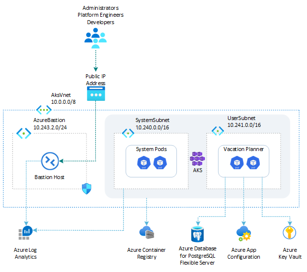

# Vacation Planner: Azure App Configuration and Azure Key Vault

> A .NET version of this sample lives in [../dotnet](../dotnet/README.md).

This sample demonstrates a Python Flask single-page web application called *Vacation Planner* hosted on an [Azure Kubernetes Service (AKS)](https://learn.microsoft.com/en-us/azure/aks/what-is-aks) cluster in the cloud on Azure or locally in the LocalStack emulator for Azure. The app runs in a dedicated namespace and stores activity data in the `activities` table of the `PlannerDB` database on an [Azure Database for PostgreSQL flexible server](https://learn.microsoft.com/en-us/azure/postgresql/flexible-server/overview), exactly like [web-app-postgresql-flexible-server](../../web-app-postgresql-flexible-server/python/README.md).

What changes is **where the application gets its configuration from**. Instead of a ConfigMap and a Secret written by the deployment script, every setting lives in an [Azure App Configuration](https://learn.microsoft.com/en-us/azure/azure-app-configuration/overview) store:

- the non-secret connection settings are plain key-values in the store;
- the credentials are [Azure Key Vault](https://learn.microsoft.com/en-us/azure/key-vault/general/overview) secrets, exposed through [App Configuration Key Vault references](https://learn.microsoft.com/en-us/azure/azure-app-configuration/use-key-vault-references-python-provider), so the store stays the single configuration source;
- the [Azure App Configuration Kubernetes Provider](https://learn.microsoft.com/en-us/azure/azure-app-configuration/reference-kubernetes-provider), installed as the `Microsoft.AppConfiguration` cluster extension, reads the store with [Microsoft Entra Workload ID](https://learn.microsoft.com/en-us/azure/aks/workload-identity-overview) and materialises a ConfigMap and a Secret;
- the pods consume both with `envFrom`.

The application itself has **no Azure SDK dependency and no credential of its own** — `requirements.txt` contains no `azure-*` package. The provider resolves everything before the pod starts, so the same image would run unchanged against a hand-written ConfigMap. The [App Service version of this sample](https://github.com/localstack/localstack-azure-samples/tree/main/samples/web-app-app-configuration/python) takes the other approach and talks to App Configuration in-process; see [Which approach to use](#which-approach-to-use) for the trade-off.

Before installing the sample, create an AKS cluster with one of the following scripts. **Both the OIDC issuer and Microsoft Entra Workload ID must be enabled** — the provider's token exchange depends on them, and both scripts enable them:

- [scripts/01-system-assigned-managed-identity.sh](../../../scripts/01-system-assigned-managed-identity.sh): creates the cluster using a system-assigned managed identity as its cluster identity.
- [scripts/01-user-assigned-managed-identity.sh](../../../scripts/01-user-assigned-managed-identity.sh): creates the cluster using a user-assigned managed identity as its cluster identity.

`01-deploy-resources.sh` checks both flags before installing anything and stops with an explanation if either is off, because the alternative failure mode is silent: the extension installs and reports `Succeeded`, and the provider then fails every token exchange at reconcile time with an opaque authentication error.

Besides the tools listed in the [repository README](../../../README.md), this sample needs `psql` and `openssl` on the host. The `k8s-extension` Azure CLI extension is installed by `01-deploy-resources.sh`.

All commands below are run from this sample's `scripts/` folder.

> **Running on LocalStack?** Install the [lstk CLI](https://docs.localstack.cloud/aws/developer-tools/running-localstack/lstk/) and run `lstk az start-interception` to route Azure CLI calls to the emulator. See [Run against LocalStack](../../../README.md#run-against-localstack) for the full setup.

## Architecture

The following diagram illustrates the architecture of the solution:



### Where each setting lives

| Setting | Stored as | Key or secret name | Content type | Reaches the pod as |
| ------- | --------- | ------------------ | ------------ | ------------------ |
| `PG_HOST` | App Configuration key-value | `PG_HOST` | none | ConfigMap key |
| `PG_PORT` | App Configuration key-value | `PG_PORT` | none | ConfigMap key |
| `PG_DATABASE` | App Configuration key-value | `PG_DATABASE` | none | ConfigMap key |
| `LOGIN_NAME` | App Configuration key-value | `LOGIN_NAME` | none | ConfigMap key |
| `DEBUG` | App Configuration key-value | `DEBUG` | none | ConfigMap key |
| `CONFIG_VERSION` | App Configuration key-value (refresh sentinel) | `CONFIG_VERSION` | none | ConfigMap key |
| `PG_USER` | Key Vault secret, referenced from the store | `PG_USER` → `pg-user` | `application/vnd.microsoft.appconfig.keyvaultref+json;charset=utf-8` | Secret key |
| `PG_PASSWORD` | Key Vault secret, referenced from the store | `PG_PASSWORD` → `pg-password` | same as above | Secret key |
| `SECRET_KEY` | Key Vault secret, referenced from the store | `SECRET_KEY` → `secret-key` | same as above | Secret key |

The Key Vault references use **versionless** secret identifiers, so rotating a secret is followed automatically without editing the store.

### How the provider turns the store into Kubernetes objects

The [`AzureAppConfigurationProvider`](scripts/appconfigurationprovider.yml) custom resource (`azconfig.io/v1`) selects every unlabelled key of the store. Plain values become the ConfigMap named under `spec.target`; every key-value that is a Key Vault reference is resolved against the vault and written into the Secret named under `spec.secret.target`. Both objects are **owned by the resource**: edit one by hand and the controller resets it, delete the resource and both go with it.

### How the provider authenticates

No connection string, no access key, and no secret in any manifest:

1. the [service account](scripts/serviceaccount.yml) is annotated with the managed identity's `client-id` and `tenant-id`;
2. a [federated identity credential](https://learn.microsoft.com/en-us/azure/aks/workload-identity-overview) ties that identity to the subject `system:serviceaccount:vacation-planner-appconfig:vacation-planner-appconfig-sa` on the cluster's OIDC issuer;
3. the provider requests a token for the service account through the Kubernetes TokenRequest API and exchanges it for a Microsoft Entra token of the managed identity;
4. it reads the store as **App Configuration Data Reader** and the vault as **Key Vault Secrets User**.

The app's own pod template carries **no** `azure.workload.identity/use` label, unlike [web-app-managed-identity](../../web-app-managed-identity/python/README.md): the application never calls Azure. It runs with the same service account only so the objects it consumes and the identity that produced them stay visibly connected. The label that matters is on the provider's controller pod, which the extension installs in the `azappconfig-system` namespace.

### Why every key is flat

A key such as `Settings:Color` is a perfectly valid App Configuration key and an invalid Kubernetes ConfigMap or Secret data key — on Azure just as much as on the emulator. The ConfigMap has an escape hatch, `spec.target.configMapData` with `type: json`, which writes a single JSON document the app parses itself; a Secret has none. This sample keeps flat, colon-free keys so a plain `envFrom` works for both objects. If your store uses hierarchical keys, that is the first thing you will hit.

### Which approach to use

| | This sample (Kubernetes provider) | [App Service version](https://github.com/localstack/localstack-azure-samples/tree/main/samples/web-app-app-configuration/python) (in-process provider) |
| --- | --- | --- |
| Where configuration is resolved | Outside the process, by the controller | Inside the process, by the Azure SDK |
| Application dependencies | None | `azure-appconfiguration-provider`, `azure-identity` |
| Picking up a change | ConfigMap updates automatically; the pod needs a restart because environment variables are immutable | In-process refresh, no restart |
| Feature management | Not used here | Available |

Secrets can also reach a pod without App Configuration at all, by mounting them with the [Azure Key Vault provider for Secrets Store CSI Driver](https://learn.microsoft.com/en-us/azure/aks/csi-secrets-store-driver) — see [tutorials/key-vault-csi-driver](../../../tutorials/key-vault-csi-driver/). This sample resolves them through App Configuration instead, which keeps one configuration source for secret and non-secret values alike.

Feature flags are deliberately out of scope. The store, the provider and the custom resource all support them; see [Add feature flags to workloads in Azure Kubernetes Service](https://learn.microsoft.com/en-us/azure/azure-app-configuration/quickstart-feature-flag-azure-kubernetes-service).

## Deployment workflow

Run the numbered scripts in order from the `scripts/` folder:

```bash
cd scripts
./01-deploy-resources.sh
./02-build-docker-image.sh
./03-run-docker-container.sh   # optional local smoke test
./04-push-docker-image.sh
./05-deploy-app.sh
```

## Scripts and manifests

| File | Description |
| ---- | ----------- |
| [`00-variables.sh`](scripts/00-variables.sh) | Defines the variables shared across the other scripts (resource names, image tag, PostgreSQL credentials, Key Vault secret names, the refresh sentinel, the cluster extension, the Kubernetes namespace, …). The other scripts load these values by sourcing this file. |
| [`01-deploy-resources.sh`](scripts/01-deploy-resources.sh) | Deploys everything this sample needs: the resource group, the [Azure Container Registry (ACR)](https://learn.microsoft.com/en-us/azure/container-registry/container-registry-intro), the user-assigned managed identity, the PostgreSQL flexible server with the `PlannerDB` database and the seeded `activities` table, the Key Vault and its three secrets, the App Configuration store with its key-values and Key Vault references, the two role assignments, and the `Microsoft.AppConfiguration` cluster extension. Every step is idempotent. Requires `psql` and `openssl` on the host. |
| [`02-build-docker-image.sh`](scripts/02-build-docker-image.sh) | Builds the Docker image for the web app from the [`src/`](src/) folder. |
| [`03-run-docker-container.sh`](scripts/03-run-docker-container.sh) | Runs the web app in a local Docker container (no Kubernetes). It resolves the settings from the App Configuration store with `az appconfig kv list --resolve-keyvault`, so even the local run proves the store's contents rather than re-reading `00-variables.sh`. |
| [`04-push-docker-image.sh`](scripts/04-push-docker-image.sh) | Tags and pushes the Docker image to the Azure Container Registry, on Azure or in the LocalStack emulator. |
| [`05-deploy-app.sh`](scripts/05-deploy-app.sh) | Applies the YAML manifests below (templated with `yq`): the namespace, the annotated service account, the federated identity credential, the provider resource — waiting for it to reconcile and printing what it generated — then the Deployment and the Service. |
| [`Dockerfile`](scripts/Dockerfile) | Builds the Docker image of the web app. |
| [`namespace.yml`](scripts/namespace.yml) | Creates the Kubernetes namespace. |
| [`serviceaccount.yml`](scripts/serviceaccount.yml) | Creates the service account the provider authenticates as, annotated with the managed identity's client id and tenant id. Applied on every run, so a re-created identity is picked up rather than silently left stale. |
| [`appconfigurationprovider.yml`](scripts/appconfigurationprovider.yml) | Creates the `AzureAppConfigurationProvider` resource: the store endpoint, the key selection, the refresh sentinel, and the ConfigMap and Secret to generate. |
| [`deployment.yml`](scripts/deployment.yml) | Creates the Kubernetes Deployment. The pod takes the generated ConfigMap and Secret wholesale with `envFrom`, so a key added to the store reaches the pods without editing this manifest. The liveness and readiness probes call `GET /health`. |
| [`service.yml`](scripts/service.yml) | Creates the `ClusterIP` Service that exposes the web app inside the cluster. |

There is no `configmap.yml` and no `secret.yml`: the provider owns both objects.

## Accessing the web app

The app is exposed through a `ClusterIP` service, which is only reachable from inside the cluster. Port-forward it to a local port to open it from your machine:

```bash
kubectl port-forward service/vacation-planner-appconfig 8080:80 -n vacation-planner-appconfig
```

Then browse to [http://localhost:8080](http://localhost:8080). Alternatively, use a tool such as [k9s](https://k9scli.io/) to start the port-forward interactively.

The app also exposes `GET /health`, the endpoint the liveness and readiness probes call: it returns `{"status": "ok"}` when the PostgreSQL flexible server is reachable and `503` with `{"status": "unavailable"}` otherwise.

```bash
curl http://localhost:8080/health
```

## Configuration refresh

`CONFIG_VERSION` is the store's **refresh sentinel**. The provider watches that single key and re-reads the whole selection when it changes, which is cheaper than polling every key. The interval is 30 seconds.

Change a value and bump the sentinel:

```bash
az appconfig kv set --name local-aks-appconfig-test --key DEBUG --value true --yes
az appconfig kv set --name local-aks-appconfig-test --key CONFIG_VERSION --value 2 --yes
```

Within the refresh interval the generated ConfigMap shows the new values:

```bash
kubectl get configmap vacation-planner-appconfig-config -n vacation-planner-appconfig -o jsonpath='{.data}'
```

The running pods do **not** see them yet. Environment variables are immutable once a container has started, so the change reaches the application only after a restart:

```bash
kubectl rollout restart deployment/vacation-planner-appconfig -n vacation-planner-appconfig
kubectl rollout status deployment/vacation-planner-appconfig -n vacation-planner-appconfig
# --selector, not deployment/...: right after a restart `kubectl logs deployment/...` can still pick a
# pod from the old ReplicaSet and show you the previous value.
kubectl logs --selector app=vacation-planner-appconfig -n vacation-planner-appconfig | grep "Configuration version"
```

`01-deploy-resources.sh` writes the sentinel only when it does not exist, so a manual bump survives a re-run.

To avoid the restart entirely, mount the ConfigMap as a volume and re-read the file, or use the in-process provider as the App Service version of this sample does. Secret refresh is a separate switch (`spec.secret.refresh`), left off here because rotating the database password also needs an `ALTER ROLE` on the server.

## Logs

The app logs one line per request — gunicorn writes an access log line for every call, the probes included — plus one line per database read and write, one line for every activity added, updated or deleted, and one line at startup naming the configuration version it booted with. The [.NET version](../dotnet/README.md) writes the same trace.

```bash
kubectl logs deployment/vacation-planner-appconfig -n vacation-planner-appconfig --tail=50
```

The provider's controller logs separately, and is where an authentication or resolution failure shows up:

```bash
kubectl logs deployment/az-appconfig-k8s-provider -n azappconfig-system --tail=50
```

## Troubleshooting

| Symptom | Cause and fix |
| ------- | ------------- |
| The provider stays `Failed` with a 401 or 403 in `.status.message` | The role assignments have not propagated (up to 10 minutes on Azure), or the service account's `client-id` annotation does not match the managed identity. Re-run `05-deploy-app.sh`. |
| On the **first** Azure deploy the provider reports `Failed` for a minute or two | Expected. A federated identity credential created moments earlier is not usable yet (`AADSTS70025`), and role assignments take up to ten minutes to propagate. The controller requeues and recovers by itself, and `05-deploy-app.sh` waits up to ten minutes rather than treating `Failed` as terminal. |
| `AADSTS70021` or another `AADSTS` error that does not clear | The federated credential's subject or issuer does not match the service account. `05-deploy-app.sh` recreates the credential when the subject differs; check that it is pointing at this namespace. |
| The ConfigMap is never created | The provider is not installed, or the extension is not `Succeeded`. Check `az k8s-extension show --cluster-type managedClusters --cluster-name local-aks-test --resource-group local-rg --name appconfigurationkubernetesprovider`. |
| The extension is `Succeeded` but nothing is in the cluster | On the emulator, `provisioningState` alone is not proof: check `kubectl -n azappconfig-system get deploy`. This is why `01-deploy-resources.sh` waits for the rollout as well. |
| The store or the vault cannot be created because the name is taken | Both are soft-deleted rather than deleted. `01-deploy-resources.sh` recovers them automatically; to start from scratch, purge them with `az appconfig purge` and `az keyvault purge`. |
| Everything disappeared after restarting the emulator | Clusters and their extensions do not survive an emulator restart. Re-run `01-deploy-resources.sh` after recreating the cluster. |
| `az` fails with `invalid_instance: The authority you provided ... is not known` | A cached CLI token went stale with an emulator restart. Run `az config set core.instance_discovery=false`, then sign in again. |

## References

- [Azure App Configuration Kubernetes Provider reference](https://learn.microsoft.com/en-us/azure/azure-app-configuration/reference-kubernetes-provider)
- [Quickstart: Use Azure App Configuration in Azure Kubernetes Service](https://learn.microsoft.com/en-us/azure/azure-app-configuration/quickstart-azure-kubernetes-service?tabs=extension)
- [Install the Azure App Configuration extension for AKS](https://learn.microsoft.com/en-us/azure/aks/azure-app-configuration)
- [Tutorial: Use dynamic configuration in Azure Kubernetes Service](https://learn.microsoft.com/en-us/azure/azure-app-configuration/enable-dynamic-configuration-azure-kubernetes-service)
- [Use Microsoft Entra Workload ID with AKS](https://learn.microsoft.com/en-us/azure/aks/workload-identity-overview)
- [Use Key Vault references in App Configuration](https://learn.microsoft.com/en-us/azure/azure-app-configuration/use-key-vault-references-python-provider)
- [Access Azure App Configuration using Microsoft Entra ID](https://learn.microsoft.com/en-us/azure/azure-app-configuration/concept-enable-rbac)
- [Provide access to Key Vault with Azure RBAC](https://learn.microsoft.com/en-us/azure/key-vault/general/rbac-guide)
- [Azure App Configuration Kubernetes Provider on GitHub](https://github.com/Azure/AppConfiguration-KubernetesProvider)
