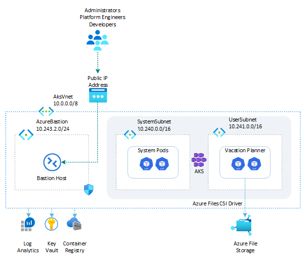

# Vacation Planner: Azure Files

> A .NET version of this sample lives in [../dotnet](../dotnet/README.md).

This sample demonstrates a Python Flask single-page web application called *Vacation Planner* hosted on an [Azure Kubernetes Service (AKS)](https://learn.microsoft.com/en-us/azure/aks/what-is-aks) cluster in the cloud on Azure or locally in the LocalStack emulator for Azure. The app runs in a dedicated namespace and stores each activity as a text file on an [Azure Files](https://learn.microsoft.com/en-us/azure/storage/files/storage-files-introduction) share, mounted into every pod by the [Azure Files CSI driver](https://learn.microsoft.com/en-us/azure/aks/azure-files-csi).

Unlike every other sample in this repository, the app uses **no Azure SDK at all**: no client library, no connection string, no account key, not a single line of authentication code. It calls `open()`, `os.listdir()` and `os.remove()` on a directory, and the CSI driver turns that directory into an Azure file share. That is the point of the sample, and it is what makes Azure Files the shortest path to persistence for an application that already speaks the file system.

The three replicas of the deployment mount the same share at the same time (`ReadWriteMany`), so an activity added through one pod is served by all of them. The UI shows the name of the pod that served the page, which makes that visible.

Before installing the sample, make sure to create an [Azure Kubernetes Service (AKS)](https://learn.microsoft.com/en-us/azure/aks/what-is-aks) cluster by using one of the following scripts:

- [scripts/01-system-assigned-managed-identity.sh](../../../scripts/01-system-assigned-managed-identity.sh): creates the cluster using a system-assigned managed identity as its cluster identity.
- [scripts/01-user-assigned-managed-identity.sh](../../../scripts/01-user-assigned-managed-identity.sh): creates the cluster using a user-assigned managed identity as its cluster identity.

Both scripts check that the Azure Files CSI driver and the CSI snapshot controller are enabled on the cluster, and enable the `Microsoft.Storage` service endpoint on the node subnets, which an NFS share requires. They print the cluster's `storageProfile` and its storage classes when they are done.

All commands below are run from this sample's `scripts/` folder.

> **Running on LocalStack?** Install the [lstk CLI](https://docs.localstack.cloud/aws/developer-tools/running-localstack/lstk/) and run `lstk az start-interception` to route Azure CLI calls to the emulator. See [Run against LocalStack](../../../README.md#run-against-localstack) for the full setup.

## Architecture

The following diagram illustrates the architecture of the solution:



## Provisioning mode and protocol

The first script asks two questions and remembers the answers, so the sample covers four combinations with one set of scripts:

| | **Static**: the file share is created by `01-deploy-resources.sh` | **Dynamic**: the file share is created by the CSI driver |
| --- | --- | --- |
| **SMB** | A `StorageV2` account with a `Standard_LRS` SMB share, a `PersistentVolume` that points at it, and a Secret holding the account key for the mount. | A claim on the built-in `azurefile-csi` storage class. The driver creates the storage account and the share in the node resource group. |
| **NFS** | A premium `FileStorage` account with an NFS share, restricted to the node subnets, and a `PersistentVolume` with `protocol: nfs` and no Secret. | A claim on the `vacation-planner-file-nfs` storage class created from [`storageclass-nfs.yml`](scripts/storageclass-nfs.yml), because none of the built-in classes provisions an NFS share. |

Static provisioning is the better default: it works unchanged on Azure, needs no premium account, and produces a share you can inspect with `az storage file list`. Dynamic provisioning is the better demonstration of the driver itself, since the driver creates the storage account and the share on its own, in the cluster's node resource group.

Both answers are stored in `scripts/.deploy-options.env` (git-ignored), so `05-deploy-app.sh` deploys the app for the same combination without asking again. Exporting the two variables skips the menus, which is what an unattended run does:

```bash
PROVISIONING_MODE=dynamic FILE_SHARE_PROTOCOL=nfs ./01-deploy-resources.sh
```

An exported variable always wins over the stored answer, so make sure the two agree: deploying a static volume for a share that was never created leaves the pods in `ContainerCreating` with a mount error. Both scripts print the combination they are working on.

## SMB or NFS

The two protocols are not interchangeable, and the differences are what the sample makes visible:

| | SMB | NFS |
| --- | --- | --- |
| Authentication | The storage account key (NTLMv2), which the driver reads from a Kubernetes Secret with the fixed keys `azurestorageaccountname` and `azurestorageaccountkey`. | None. Access is granted by the network rules of the storage account, which is why the account has to be restricted to the node subnets. |
| Storage account | Any account kind, `Standard_LRS` is enough. | A premium `FileStorage` account: [NFS shares are only available on SSD file shares](https://learn.microsoft.com/en-us/azure/storage/files/files-nfs-protocol), with a 100 GiB minimum. |
| Permissions | Synthesized by the client from the `uid`, `gid`, `file_mode` and `dir_mode` mount options: no ownership is stored on the share. | Real POSIX ownership stored on the share, and the mount options above are ignored. The share arrives owned by `root`, so the init container of the deployment takes ownership of it as uid 1000. |
| Network | Reachable over the public endpoint. | Reachable only from a private endpoint or from a virtual network with the `Microsoft.Storage` service endpoint. |
| Secure transfer | Required, and on by default. | Must be off, unless the client uses the AZNFS TLS helper. |
| Interoperability | The same share is reachable over the file data plane REST API, so `az storage file list` shows the files the pods write. | Not reachable over the file data plane REST API on Azure: use `kubectl exec` to look at the share. |

`securityContext.fsGroup` is deliberately **not** used to make the NFS share writable. The `file.csi.azure.com` CSIDriver object declares `fsGroupPolicy: ReadWriteOnceWithFSType`, so the kubelet applies `fsGroup` only to a `ReadWriteOnce` volume with a file system type. This volume is `ReadWriteMany`, so setting `fsGroup` would silently do nothing. The init container chowning the mount point is the documented way out.

## Deployment workflow

Run the numbered scripts in order from the `scripts/` folder:

```bash
cd scripts
./01-deploy-resources.sh
./02-build-docker-image.sh
./03-run-docker-container.sh   # optional local smoke test
./04-push-docker-image.sh
./05-deploy-app.sh
```

## Scripts and manifests

| File | Description |
| ---- | ----------- |
| [`00-variables.sh`](scripts/00-variables.sh) | Defines the variables shared across the other scripts (resource names, image tag, storage account and file share names, Kubernetes namespace, mount path, …). The other scripts load these values by sourcing this file. |
| [`01-deploy-resources.sh`](scripts/01-deploy-resources.sh) | Asks for the provisioning mode and the protocol, then deploys the Azure resources used by this sample: the resource group, the [Azure Container Registry (ACR)](https://learn.microsoft.com/en-us/azure/container-registry/container-registry-intro), and, in static mode, the storage account and the [Azure file share](https://learn.microsoft.com/en-us/azure/storage/files/storage-files-introduction) for the chosen protocol. |
| [`02-build-docker-image.sh`](scripts/02-build-docker-image.sh) | Builds the Docker image for the web app from the [`src/`](src/) folder. |
| [`03-run-docker-container.sh`](scripts/03-run-docker-container.sh) | Runs the web app in a local Docker container (no Kubernetes, no Azure resource) with a directory on the host mounted where the Azure file share goes, to validate that it starts and stores the activities as expected. |
| [`04-push-docker-image.sh`](scripts/04-push-docker-image.sh) | Tags and pushes the Docker image to the Azure Container Registry, on Azure or in the LocalStack emulator. |
| [`05-deploy-app.sh`](scripts/05-deploy-app.sh) | Uses the YAML manifests below (templated with `yq`) to deploy the app to the AKS cluster, applying only the ones the chosen combination needs, and waits for the rollout to complete. |
| [`Dockerfile`](scripts/Dockerfile) | Builds the Docker image of the web app. Unlike the other samples it pins the app user to uid and gid 1000, because that identity appears in the mount options of the SMB volume and in the ownership of the NFS share. |
| [`namespace.yml`](scripts/namespace.yml) | Creates the Kubernetes namespace. |
| [`configmap.yml`](scripts/configmap.yml) | Creates the ConfigMap holding non-secret input values (the directory where the file share is mounted) passed to the app as environment variables. |
| [`seed-configmap.yml`](scripts/seed-configmap.yml) | Holds the sample activities the init container copies into the file share when they are missing, so the app is never empty on the first page load. |
| [`secret.yml`](scripts/secret.yml) | Creates the Secret holding the Flask secret key. It holds no storage credential: the app never authenticates to Azure. |
| [`storage-secret.yml`](scripts/storage-secret.yml) | Creates the Secret holding the storage account name and key the CSI driver uses to mount the SMB share. Applied for the static SMB combination only. |
| [`persistentvolume-smb.yml`](scripts/persistentvolume-smb.yml) | Creates the `PersistentVolume` bound to a pre-created SMB file share, with the account key secret and the `uid`, `gid` and mode mount options. |
| [`persistentvolume-nfs.yml`](scripts/persistentvolume-nfs.yml) | Creates the `PersistentVolume` bound to a pre-created NFS file share, with `protocol: nfs`, the NFS mount options, and no secret. |
| [`persistentvolumeclaim.yml`](scripts/persistentvolumeclaim.yml) | Creates the `ReadWriteMany` claim the pods mount. Committed in its static shape (pre-bound by name, empty storage class); `05-deploy-app.sh` rewrites those two fields for dynamic provisioning. |
| [`storageclass-nfs.yml`](scripts/storageclass-nfs.yml) | Creates the storage class that provisions an NFS file share on demand (`protocol: nfs`, `skuName: Premium_LRS`). Applied for the dynamic NFS combination only. |
| [`deployment.yml`](scripts/deployment.yml) | Creates the Kubernetes Deployment: three replicas mounting the same share, plus the init container that prepares and seeds it. The liveness and readiness probes call `GET /health`. |
| [`service.yml`](scripts/service.yml) | Creates the `ClusterIP` Service that exposes the web app inside the cluster. |

## Accessing the web app

The app is exposed through a `ClusterIP` service, which is only reachable from inside the cluster. Port-forward it to a local port to open it from your machine:

```bash
kubectl port-forward service/vacation-planner-file 8080:80 -n vacation-planner-file
```

Then browse to [http://localhost:8080](http://localhost:8080). Alternatively, use a tool such as [k9s](https://k9scli.io/) to start the port-forward interactively.

The app also exposes `GET /health`, the endpoint the liveness and readiness probes call: it returns `{"status": "ok"}` when the mounted file share is reachable and `503` with `{"status": "unavailable"}` otherwise.

```bash
curl http://localhost:8080/health
```

## Looking at the file share

Every activity is one UTF-8 text file named `YYYY-MM-DD-HH-MM-SS-activity.txt`. From inside the cluster, on any of the three replicas and for any of the four combinations:

```bash
kubectl exec -n vacation-planner-file deployment/vacation-planner-file -- ls -l /data
```

An SMB share is reachable over the file data plane REST API as well, so the files the pods write can also be listed from your machine, which is a neat way to see that the volume really is an Azure file share:

```bash
az storage file list --account-name localfilesmbtest --share-name activities --output table
```

The same command does not work for an NFS share on Azure, which has no REST data plane, and it needs the account key or a role assignment on the account.

## Cleaning up

The namespace holds the app, but the `PersistentVolume` and the storage class are cluster-scoped and survive `kubectl delete namespace`. They also have to go before switching to another combination, because the fields of a claim cannot be changed after it is created:

```bash
kubectl delete namespace vacation-planner-file
kubectl delete pv vacation-planner-file-pv --ignore-not-found
kubectl delete storageclass vacation-planner-file-nfs --ignore-not-found
```

The volume is created with `persistentVolumeReclaimPolicy: Retain`, so deleting it leaves the file share and the activities in place: the same share is picked up again the next time the sample is deployed. In dynamic mode the storage class reclaim policy is `Delete`, so the share the driver created goes away with the claim, while the storage account it created in the node resource group stays behind (the driver never deletes an account). Delete it by hand, or delete the whole resource group, when you are done:

```bash
az storage account list \
  --resource-group $(az aks show --name local-aks-test --resource-group local-rg --query nodeResourceGroup --output tsv) \
  --output table
```

## Running on Azure

The sample runs unchanged against Azure, with two things to keep in mind for the NFS combinations:

- The mount needs the storage account to be restricted to the node subnets. `01-deploy-resources.sh` reads the node subnets from the cluster and configures them for the static combination, and the CSI driver does it for the dynamic one. When it cannot, it says so with a warning instead of leaving you to discover it from a mount timeout.
- A premium file share is provisioned capacity, so the 100 GiB minimum is billed whether it holds three text files or a hundred gigabytes.

One behaviour is worth knowing in both protocols: `actimeo=30` caches directory metadata for 30 seconds, so an activity added through one replica can take a few seconds to show up on another. That is the ordinary trade-off of a shared file system, not a bug in the sample.
