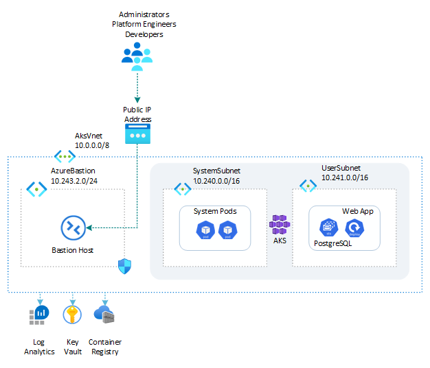

# Vacation Planner: in-cluster PostgreSQL

This sample demonstrates a Python Flask single-page web application called *Vacation Planner* hosted on an [Azure Kubernetes Service (AKS)](https://learn.microsoft.com/en-us/azure/aks/what-is-aks) cluster in the cloud on Azure or locally in the LocalStack emulator for Azure. The app runs in a dedicated namespace and stores activity data in the `activities` table of the `PlannerDB` database on an **in-cluster PostgreSQL database** — a primary plus two streaming-replica pods deployed as a Kubernetes [StatefulSet](https://kubernetes.io/docs/concepts/workloads/controllers/statefulset/), rather than a managed service such as Azure Database for PostgreSQL flexible server.

The database runs entirely inside the cluster: PostgreSQL 16 pods are backed by Azure managed-disk `PersistentVolumeClaim`s, and they are exposed through three `ClusterIP` services — a headless service for stable per-pod DNS, a *primary* (write) endpoint targeting the pod-0 leader, and a *read* endpoint that round-robins across all replicas. The application connects to the primary (write) endpoint using a dedicated application user (`testuser`) rather than the `postgres` superuser, and the deployment seeds the `activities` table with a handful of sample plans so the app shows data on first load.

Before installing the sample, make sure to create an [Azure Kubernetes Service (AKS)](https://learn.microsoft.com/en-us/azure/aks/what-is-aks) cluster by using one of the following scripts:

- [scripts/01-system-assigned-managed-identity.sh](../../scripts/01-system-assigned-managed-identity.sh): creates the cluster using a system-assigned managed identity as its cluster identity.
- [scripts/01-user-assigned-managed-identity.sh](../../scripts/01-user-assigned-managed-identity.sh): creates the cluster using a user-assigned managed identity as its cluster identity.

All commands below are run from this sample's `scripts/` folder.

> **Running on LocalStack?** Install the [lstk CLI](https://docs.localstack.cloud/aws/developer-tools/running-localstack/lstk/) and run `lstk az start-interception` to route Azure CLI calls to the emulator. See [Run against LocalStack](../../README.md#run-against-localstack) for the full setup.

## Architecture

The following diagram illustrates the architecture of the solution:



## Deployment workflow

Run the numbered scripts in order from the `scripts/` folder:

```bash
cd scripts
./01-deploy-resources.sh
./02-build-docker-image.sh
./04-push-docker-image.sh
./05-deploy-app.sh
```

`05-deploy-app.sh` deploys the in-cluster PostgreSQL StatefulSet, provisions the database/user and seeds the sample data, and then deploys the app, so it requires `psql` on the host machine (it connects to the database through a `kubectl port-forward`).

Optionally, **after** `05-deploy-app.sh` has deployed and provisioned the database, run `./03-run-docker-container.sh` for a local smoke test — it runs the container outside Kubernetes and connects to the in-cluster database through a `kubectl port-forward`.

## Scripts and manifests

| File | Description |
| ---- | ----------- |
| [`00-variables.sh`](scripts/00-variables.sh) | Defines the variables shared across the other scripts (resource names, image tag, in-cluster PostgreSQL credentials, StatefulSet and service names, Kubernetes namespace, …). The other scripts load these values by sourcing this file. |
| [`01-deploy-resources.sh`](scripts/01-deploy-resources.sh) | Deploys the Azure resources used by this sample: the resource group and the [Azure Container Registry (ACR)](https://learn.microsoft.com/en-us/azure/container-registry/container-registry-intro). There is no managed database to create — PostgreSQL runs in-cluster and is deployed by `05-deploy-app.sh`. |
| [`02-build-docker-image.sh`](scripts/02-build-docker-image.sh) | Builds the Docker image for the web app from the [`src/`](src/) folder. |
| [`03-run-docker-container.sh`](scripts/03-run-docker-container.sh) | Runs the web app in a local Docker container (no Kubernetes), connecting to the in-cluster database through a `kubectl port-forward` to the primary service. Run it after `05-deploy-app.sh` has deployed and provisioned the database. |
| [`04-push-docker-image.sh`](scripts/04-push-docker-image.sh) | Tags and pushes the Docker image to the Azure Container Registry, on Azure or in the LocalStack emulator. |
| [`05-deploy-app.sh`](scripts/05-deploy-app.sh) | Deploys the in-cluster PostgreSQL StatefulSet and waits for it to become ready, then (over a `kubectl port-forward` to the primary, so it requires `psql` on the host) creates the `PlannerDB` database, the dedicated application user and its grants, and the `activities` table, which it also seeds with sample data. Finally it deploys the app to the AKS cluster using the YAML manifests below (templated with `yq`). |
| [`Dockerfile`](scripts/Dockerfile) | Builds the Docker image of the web app. |
| [`namespace.yml`](scripts/namespace.yml) | Creates the Kubernetes namespace. |
| [`statefulset.yml`](scripts/statefulset.yml) | Creates the in-cluster PostgreSQL cluster: a Secret with the superuser and replication passwords, a ConfigMap with the primary/replica init scripts, the headless / primary (write) / read `ClusterIP` services, and a 3-replica StatefulSet (one primary plus two standbys configured for streaming replication) backed by Azure managed-disk PVCs. |
| [`configmap.yml`](scripts/configmap.yml) | Creates the ConfigMap holding non-secret input values (the in-cluster PostgreSQL primary service host, database, user, login name) passed to the app as environment variables. |
| [`secret.yml`](scripts/secret.yml) | Creates the Secret holding sensitive values (the application user's PostgreSQL password and the Flask secret key) passed to the app as environment variables. |
| [`deployment.yml`](scripts/deployment.yml) | Creates the Kubernetes Deployment, including the pod specification for the web app. |
| [`service.yml`](scripts/service.yml) | Creates the `ClusterIP` Service that exposes the web app inside the cluster. |

## Accessing the web app

The app is exposed through a `ClusterIP` service, which is only reachable from inside the cluster. Port-forward it to a local port to open it from your machine:

```bash
kubectl port-forward service/vacation-planner-postgres 8080:80 -n vacation-planner-postgres
```

Then browse to [http://localhost:8080](http://localhost:8080). Alternatively, use a tool such as [k9s](https://k9scli.io/) to start the port-forward interactively.
