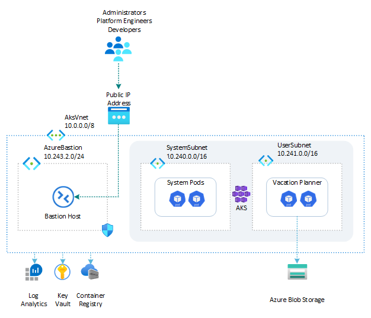

# Vacation Planner: Azure Blob Storage with Microsoft Entra Workload ID

This sample demonstrates a Python Flask single-page web application called *Vacation Planner* hosted on an [Azure Kubernetes Service (AKS)](https://learn.microsoft.com/en-us/azure/aks/what-is-aks) cluster in the cloud on Azure or locally in the LocalStack emulator for Azure. The app runs in a dedicated namespace and stores activity data in the `activities` container of an [Azure Blob Storage](https://learn.microsoft.com/en-us/azure/storage/blobs/storage-blobs-introduction) account.

Unlike the [`web-app-storage-account`](../web-app-storage-account/) sample, which uses a connection string, this sample authenticates to the storage account without any secret, using [Microsoft Entra Workload ID](https://learn.microsoft.com/en-us/azure/aks/workload-identity-overview). A [user-assigned managed identity](https://learn.microsoft.com/en-us/entra/identity/managed-identities-azure-resources/overview) is federated with a Kubernetes service account, so the pod obtains Microsoft Entra tokens through the cluster's OIDC issuer and accesses the storage account with its RBAC role assignment.

Optionally, when `DEPLOY_GATEWAY="true"` in [`00-variables.sh`](scripts/00-variables.sh), the sample also exposes the app on a public hostname through the [Gateway API](https://gateway-api.sigs.k8s.io/), with an A record created in an [Azure DNS](https://learn.microsoft.com/en-us/azure/dns/dns-overview) zone and a TLS certificate issued via [cert-manager](https://cert-manager.io/).

Before installing the sample, make sure to create an [Azure Kubernetes Service (AKS)](https://learn.microsoft.com/en-us/azure/aks/what-is-aks) cluster by using one of the following scripts:

- [scripts/01-system-assigned-managed-identity.sh](../../scripts/01-system-assigned-managed-identity.sh): creates the cluster using a system-assigned managed identity as its cluster identity.
- [scripts/01-user-assigned-managed-identity.sh](../../scripts/01-user-assigned-managed-identity.sh): creates the cluster using a user-assigned managed identity as its cluster identity.

Both scripts enable the OIDC issuer and workload identity that this sample relies on. If you enable the Gateway path, also install the [Gateway API](https://gateway-api.sigs.k8s.io/) and [cert-manager](https://cert-manager.io/) add-ons from the root `scripts/` folder. All commands below are run from this sample's `scripts/` folder.

## Architecture

The following diagram illustrates the architecture of the solution:



## Deployment workflow

Run the numbered scripts in order from the `scripts/` folder:

```bash
cd scripts
./01-deploy-resources.sh
./02-build-docker-image.sh
./03-run-docker-container.sh   # optional local smoke test
./04-push-docker-image.sh
./05-deploy-app.sh
```

## Scripts and manifests

| File | Description |
| ---- | ----------- |
| [`00-variables.sh`](scripts/00-variables.sh) | Defines the variables shared across the other scripts (resource names, image tag, managed identity and federated credential names, storage account, optional DNS/Gateway settings, Kubernetes namespace, …). The other scripts load these values by sourcing this file. |
| [`01-deploy-resources.sh`](scripts/01-deploy-resources.sh) | Deploys the Azure resources used by this sample: the resource group, the [Azure Container Registry (ACR)](https://learn.microsoft.com/en-us/azure/container-registry/container-registry-intro), the [Azure Blob Storage](https://learn.microsoft.com/en-us/azure/storage/blobs/storage-blobs-introduction) account and `activities` container, and the [user-assigned managed identity](https://learn.microsoft.com/en-us/entra/identity/managed-identities-azure-resources/overview) with its role assignment on the storage account. |
| [`02-build-docker-image.sh`](scripts/02-build-docker-image.sh) | Builds the Docker image for the web app from the [`src/`](src/) folder. |
| [`03-run-docker-container.sh`](scripts/03-run-docker-container.sh) | Runs the web app in a local Docker container (no Kubernetes) to validate that it starts and connects to the storage account as expected. |
| [`04-push-docker-image.sh`](scripts/04-push-docker-image.sh) | Tags and pushes the Docker image to the Azure Container Registry, on Azure or in the LocalStack emulator. |
| [`05-deploy-app.sh`](scripts/05-deploy-app.sh) | Creates the workload-identity service account and the [federated identity credential](https://learn.microsoft.com/en-us/entra/workload-id/workload-identity-federation) that links it to the managed identity, then uses the YAML manifests below (templated with `yq`) to deploy the app. When `DEPLOY_GATEWAY="true"`, it also applies the Issuer, Gateway, and HTTPRoute and updates the [Azure DNS](https://learn.microsoft.com/en-us/azure/dns/dns-overview) A record. |
| [`Dockerfile`](scripts/Dockerfile) | Builds the Docker image of the web app. |
| [`namespace.yml`](scripts/namespace.yml) | Creates the Kubernetes namespace. |
| [`configmap.yml`](scripts/configmap.yml) | Creates the ConfigMap holding non-secret input values (blob container name, storage account URL, managed identity client ID, tenant ID) passed to the app as environment variables. |
| [`secret.yml`](scripts/secret.yml) | Creates the Secret holding sensitive values (the Flask secret key, and the optional connection string / client secret fallback) passed to the app as environment variables. |
| [`deployment.yml`](scripts/deployment.yml) | Creates the Kubernetes Deployment, including the pod specification and the workload-identity service account reference. |
| [`service.yml`](scripts/service.yml) | Creates the `ClusterIP` Service that exposes the web app inside the cluster. |
| [`issuer.yml`](scripts/issuer.yml) | (Gateway path) cert-manager Issuer that solves the ACME HTTP-01 challenge through a Gateway API HTTPRoute. |
| [`gateway.yml`](scripts/gateway.yml) | (Gateway path) Gateway API Gateway that exposes the app on the configured public hostname. |
| [`httproute.yml`](scripts/httproute.yml) | (Gateway path) Gateway API HTTPRoute that routes the hostname's traffic to the Service. |

## Accessing the web app

By default the app is exposed through a `ClusterIP` service, which is only reachable from inside the cluster. Port-forward it to a local port to open it from your machine:

```bash
kubectl port-forward service/vacation-planner-blob 8080:80 -n vacation-planner-blob
```

Then browse to [http://localhost:8080](http://localhost:8080). Alternatively, use a tool such as [k9s](https://k9scli.io/) to start the port-forward interactively.

If you deployed the Gateway path (`DEPLOY_GATEWAY="true"`), the app is instead reachable directly at the public hostname configured in [`00-variables.sh`](scripts/00-variables.sh) (`https://<subdomain>.<dns-zone>`), with no port-forward required.
