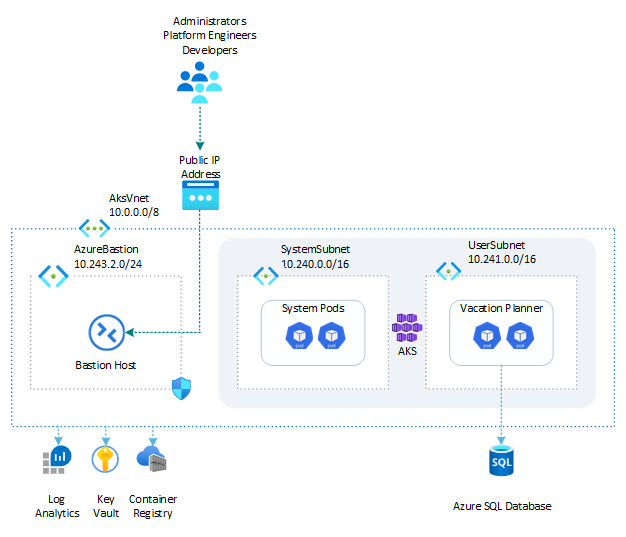

# Vacation Planner: Azure SQL Database

> A .NET version of this sample lives in [../dotnet](../dotnet/README.md).

This sample demonstrates a Python Flask single-page web application called *Vacation Planner* hosted on an [Azure Kubernetes Service (AKS)](https://learn.microsoft.com/en-us/azure/aks/what-is-aks) cluster in the cloud on Azure or locally in the LocalStack emulator for Azure. The app runs in a dedicated namespace and stores activity data in the `dbo.Activities` table of the `PlannerDB` database on an [Azure SQL Database](https://learn.microsoft.com/en-us/azure/azure-sql/database/sql-database-paas-overview).

The application connects to Azure SQL using a dedicated SQL login (rather than the server admin), and the deployment scripts seed the `Activities` table with a handful of sample plans so the app shows data on first load.

Before installing the sample, make sure to create an [Azure Kubernetes Service (AKS)](https://learn.microsoft.com/en-us/azure/aks/what-is-aks) cluster by using one of the following scripts:

- [scripts/01-system-assigned-managed-identity.sh](../../../scripts/01-system-assigned-managed-identity.sh): creates the cluster using a system-assigned managed identity as its cluster identity.
- [scripts/01-user-assigned-managed-identity.sh](../../../scripts/01-user-assigned-managed-identity.sh): creates the cluster using a user-assigned managed identity as its cluster identity.

All commands below are run from this sample's `scripts/` folder.

> **Running on LocalStack?** Install the [lstk CLI](https://docs.localstack.cloud/aws/developer-tools/running-localstack/lstk/) and run `lstk az start-interception` to route Azure CLI calls to the emulator. See [Run against LocalStack](../../../README.md#run-against-localstack) for the full setup.

## Architecture

The following diagram illustrates the architecture of the solution:



## Deployment workflow

Run the numbered scripts in order from the `scripts/` folder:

```bash
cd scripts
./01-deploy-resources.sh
./02-build-docker-image.sh
./03-run-docker-container.sh   # optional local smoke test
./04-push-docker-image.sh
./05-deploy-app.sh
```

## Scripts and manifests

| File | Description |
| ---- | ----------- |
| [`00-variables.sh`](scripts/00-variables.sh) | Defines the variables shared across the other scripts (resource names, image tag, SQL credentials, Kubernetes namespace, …). The other scripts load these values by sourcing this file. |
| [`01-deploy-resources.sh`](scripts/01-deploy-resources.sh) | Deploys the Azure resources used by this sample: the resource group, the [Azure Container Registry (ACR)](https://learn.microsoft.com/en-us/azure/container-registry/container-registry-intro), the [Azure SQL Database](https://learn.microsoft.com/en-us/azure/azure-sql/database/sql-database-paas-overview) logical server and database, a permissive firewall rule (dev/test only), a dedicated SQL login and database user with the appropriate roles, and the `Activities` table, which it also seeds with sample data. Requires `sqlcmd` on the host. |
| [`02-build-docker-image.sh`](scripts/02-build-docker-image.sh) | Builds the Docker image for the web app from the [`src/`](src/) folder. |
| [`03-run-docker-container.sh`](scripts/03-run-docker-container.sh) | Runs the web app in a local Docker container (no Kubernetes) to validate that it starts and connects to the database as expected. |
| [`04-push-docker-image.sh`](scripts/04-push-docker-image.sh) | Tags and pushes the Docker image to the Azure Container Registry, on Azure or in the LocalStack emulator. |
| [`05-deploy-app.sh`](scripts/05-deploy-app.sh) | Uses the YAML manifests below (templated with `yq`) to deploy the app to the AKS cluster. |
| [`Dockerfile`](scripts/Dockerfile) | Builds the Docker image of the web app. |
| [`namespace.yml`](scripts/namespace.yml) | Creates the Kubernetes namespace. |
| [`configmap.yml`](scripts/configmap.yml) | Creates the ConfigMap holding non-secret input values (SQL server FQDN, database, username, login name) passed to the app as environment variables. |
| [`secret.yml`](scripts/secret.yml) | Creates the Secret holding sensitive values (the SQL password and the Flask secret key) passed to the app as environment variables. |
| [`deployment.yml`](scripts/deployment.yml) | Creates the Kubernetes Deployment, including the pod specification for the web app. |
| [`service.yml`](scripts/service.yml) | Creates the `ClusterIP` Service that exposes the web app inside the cluster. |

## Accessing the web app

The app is exposed through a `ClusterIP` service, which is only reachable from inside the cluster. Port-forward it to a local port to open it from your machine:

```bash
kubectl port-forward service/vacation-planner-sql 8080:80 -n vacation-planner-sql
```

Then browse to [http://localhost:8080](http://localhost:8080). Alternatively, use a tool such as [k9s](https://k9scli.io/) to start the port-forward interactively.
