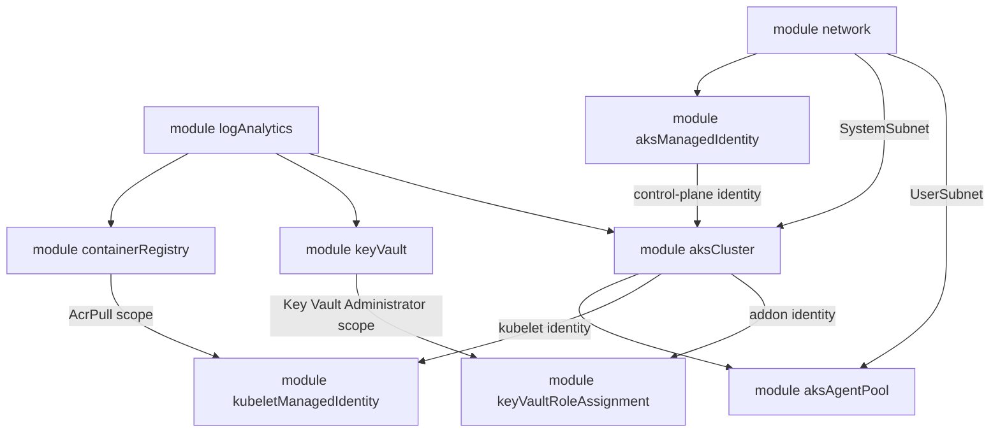

# Deploy an AKS cluster with agent-pool tags, node labels, and taints using Bicep

This sample deploys a modular [Azure Kubernetes Service (AKS)](https://learn.microsoft.com/en-us/azure/aks/what-is-aks) stack with [Bicep](https://learn.microsoft.com/en-us/azure/azure-resource-manager/bicep/overview) and focuses on the three properties you can use to classify and steer workloads across agent pools:

- [Azure resource tags](https://learn.microsoft.com/en-us/azure/azure-resource-manager/management/tag-resources) on the cluster, on every supporting resource, and on the agent-pool virtual machine scale sets.
- [Kubernetes node labels](https://learn.microsoft.com/en-us/azure/aks/use-labels) on the system and user agent pools.
- [Kubernetes node taints](https://learn.microsoft.com/en-us/azure/aks/use-node-taints) on the user agent pool.

The stack works against both real Azure and the [LocalStack for Azure](https://docs.localstack.cloud/azure/) emulator: [deploy.sh](deploy.sh) detects the target from the Azure CLI cloud configuration and skips the real-Azure-only steps automatically. A Terraform port of the same stack lives in [`~/azure/aks/terraform/tags_labels_taints`](../../terraform/tags_labels_taints/), with matching parameter names (`userNodePoolName` ↔ `user_node_pool_name`) and identical outputs.

By default the user agent pool carries the `workload=batch` node label, the `dedicated=batch:NoSchedule` node taint, and the `costcenter=1234` scale-set tags, while the system agent pool carries the `team=platform` node label — the values pinned in [main.bicepparam](main.bicepparam). The [deploy.sh](deploy.sh) validation battery then proves, both through the ARM API (`az aks nodepool show`) and through the Kubernetes API (`kubectl get nodes`), that the tags, labels, and taints actually landed on the pools and the nodes.

## Prerequisites

- [Azure CLI](https://learn.microsoft.com/en-us/cli/azure/install-azure-cli) (`az`), logged in to an Azure subscription — or pointed at the LocalStack Azure emulator. The [Bicep CLI](https://learn.microsoft.com/en-us/azure/azure-resource-manager/bicep/install) is installed automatically by `az` on first use.
- [kubectl](https://kubernetes.io/docs/tasks/tools/) and, on real Azure, [kubelogin](https://azure.github.io/kubelogin/) for the Microsoft Entra ID authentication used by the Kubernetes-side validation.
- [jq](https://jqlang.github.io/jq/) for parsing the deployment outputs in `deploy.sh`.
- Optional: an SSH public key at `~/.ssh/id_rsa.pub`. When present, `deploy.sh` passes it to the cluster's `linuxProfile`; when absent, the profile is omitted entirely (emulator-friendly).

## Architecture

[main.bicep](main.bicep) is a resource-group-scoped template that composes nine local Bicep modules (`deploy.sh` creates the `local-rg` resource group first):



### Module composition

| Module | Resources | Purpose |
| --- | --- | --- |
| [`modules/logAnalytics.bicep`](modules/logAnalytics.bicep) | `Microsoft.OperationalInsights/workspaces` | Workspace used by the cluster's `omsagent` addon (Container Insights) and by every diagnostic setting in the stack. |
| [`modules/network.bicep`](modules/network.bicep) | `Microsoft.Network/virtualNetworks`, 2 × `Microsoft.Network/virtualNetworks/subnets` | Virtual network with a `SystemSubnet` for the system agent pool and a `UserSubnet` for the user agent pool. Subnet creation is serialized (`dependsOn`) because parallel subnet writes on the same VNet fail with `AnotherOperationInProgress` on real Azure. |
| [`modules/aksManagedIdentity.bicep`](modules/aksManagedIdentity.bicep) | `Microsoft.ManagedIdentity/userAssignedIdentities`, `Microsoft.Authorization/roleAssignments` | User-assigned managed identity used as the cluster control-plane identity, granted `Network Contributor` on the VNet so the cluster can manage the node subnets. |
| [`modules/containerRegistry.bicep`](modules/containerRegistry.bicep) | `Microsoft.ContainerRegistry/registries`, `Microsoft.Insights/diagnosticSettings` | Azure Container Registry the kubelet identity pulls from. Diagnostic settings ship the repository and login events plus all metrics to Log Analytics. The Premium-only features (anonymous pull, data endpoints, zone redundancy) default off. |
| [`modules/keyVault.bicep`](modules/keyVault.bicep) | `Microsoft.KeyVault/vaults`, `Microsoft.Authorization/roleAssignments` (conditional), `Microsoft.Insights/diagnosticSettings` | Key Vault with RBAC data-plane authorization, accessed by the Azure Key Vault Secrets Provider addon identity. Grants the deploying user `Key Vault Administrator` when `userId` is set. Diagnostics ship `AuditEvent` and `AzurePolicyEvaluationDetails` plus all metrics. |
| [`modules/aksCluster.bicep`](modules/aksCluster.bicep) | `Microsoft.ContainerService/managedClusters`, `Microsoft.Authorization/roleAssignments` (conditional), `Microsoft.Insights/diagnosticSettings` | The managed cluster with its system agent pool, network profile, addon profiles, managed Microsoft Entra ID integration, auto-scaler profile, upgrade channels, Container Insights, and diagnostic settings (11 control-plane log categories plus all metrics). Grants the deploying user `Azure Kubernetes Service RBAC Cluster Admin` when `userId` is set. |
| [`modules/aksAgentPool.bicep`](modules/aksAgentPool.bicep) | `Microsoft.ContainerService/managedClusters/agentPools` | The user agent pool on `UserSubnet`, carrying the sample's node labels, node taints, and scale-set tags — the focus of the sample. |
| [`modules/kubeletManagedIdentity.bicep`](modules/kubeletManagedIdentity.bicep) | `Microsoft.Authorization/roleAssignments` | Grants the AKS kubelet identity `AcrPull` on the container registry, so nodes pull images without credentials. |
| [`modules/keyVaultRoleAssignment.bicep`](modules/keyVaultRoleAssignment.bicep) | `Microsoft.Authorization/roleAssignments` | Grants the Azure Key Vault Secrets Provider addon identity `Key Vault Administrator` on the vault. Deployed only when `azureKeyvaultSecretsProviderEnabled` is true. |

Unlike the Terraform port — which needs an `azapi` patch because the azurerm provider does not expose `ingressProfile.gatewayAPI` — the Bicep cluster module sets the [Managed Gateway API](https://learn.microsoft.com/en-us/azure/aks/managed-gateway-api) installation declaratively on the `Microsoft.ContainerService/managedClusters@2026-04-02-preview` resource (`installation: 'Standard'` when `gatewayApiEnabled` is true, `'Disabled'` otherwise).

## What is deployed by default

With the values currently in [main.bicepparam](main.bicepparam) (`prefix = 'local'`, `suffix = 'test'`) and the parameter defaults in [main.bicep](main.bicep), running `deploy.sh` deploys:

| Resource | Default name | Default configuration |
| --- | --- | --- |
| Resource group | `local-rg` | Created by `deploy.sh` in `westeurope` (the template is resource-group-scoped). |
| Log Analytics workspace | `local-log-analytics-test` | `PerGB2018` sku, 60-day retention. |
| Virtual network | `local-vnet-test` | `10.0.0.0/8`, with `SystemSubnet` (`10.240.0.0/16`) and `UserSubnet` (`10.241.0.0/16`). |
| Managed identity | `local-aks-identity-test` | Cluster control-plane identity, `Network Contributor` on the VNet. |
| Container registry | `localacrtest` | `Basic` sku, admin user enabled, public network access enabled, diagnostics to Log Analytics. |
| Key Vault | `local-kv-ciao-local` (pinned in the bicepparam; `deploy.sh` overrides it to `local-kv-test` on the emulator; the derived default would be `local-key-vault-test`) | `standard` sku, RBAC authorization, 7-day soft delete, purge protection off, public network access with `Allow` ACLs — deliberate test-sample defaults. |
| AKS cluster | `local-aks-test` | `Free` tier, latest GA Kubernetes version (looked up by `deploy.sh`; the platform default when the lookup fails), user-assigned identity, `stable` upgrade channel, `Unmanaged` node OS channel, Managed Gateway API `Standard`. |
| System agent pool | `system` | 1 × `Standard_DS2_v2`, `AzureLinux`, `Managed` OS disk, 100 max pods, autoscaling disabled (min 1 / max 3 when enabled), node label `team=platform`. |
| User agent pool | `upool1` | `User` mode, 1 × `Standard_DS2_v2`, `Linux`, `AzureLinux`, `Managed` OS disk, 100 max pods, autoscaling disabled (min 1 / max 3 when enabled), node label `workload=batch`, node taint `dedicated=batch:NoSchedule`, scale-set tags `costcenter=1234`. |

Every resource except the user agent pool is tagged `env=test`, `iac=bicep`; the user pool's scale set carries only its own `costcenter=1234` tags.

Default cluster configuration highlights:

- **Networking**: [Azure CNI Overlay](https://learn.microsoft.com/en-us/azure/aks/azure-cni-overlay) (`networkPlugin 'azure'`, `networkPluginMode 'overlay'`) with the `azure` network policy and data plane, pod CIDR `192.168.0.0/16`, service CIDR `172.16.0.0/16`, DNS service IP `172.16.0.10`, `loadBalancer` outbound type on a `standard` load balancer. `deploy.sh` offers a menu to switch the network policy to Calico, or to Cilium (which also switches the data plane to Cilium).
- **Identity and access**: [OIDC issuer](https://learn.microsoft.com/en-us/azure/aks/use-oidc-issuer) and [Microsoft Entra Workload ID](https://learn.microsoft.com/en-us/azure/aks/workload-identity-overview) enabled; managed Microsoft Entra ID integration with [Azure RBAC for Kubernetes authorization](https://learn.microsoft.com/en-us/azure/aks/manage-azure-rbac); Kubernetes RBAC enabled.
- **Addons and profiles**: [Azure Key Vault Secrets Provider](https://learn.microsoft.com/en-us/azure/aks/csi-secrets-store-driver) (secret rotation off), blob/disk/file CSI drivers and snapshot controller, [Vertical Pod Autoscaler](https://learn.microsoft.com/en-us/azure/aks/vertical-pod-autoscaler) (enabled in the bicepparam), KEDA off, cluster auto-scaler profile tuned with the sample defaults (`10s` scan interval, `random` expander, …).
- **Observability**: Container Insights (the `omsagent` addon, always on) plus diagnostic settings on the cluster (11 log categories + `AllMetrics`), the registry, and the vault, all wired to the Log Analytics workspace.

## Parameters

Every module parameter is surfaced as a `main.bicep` parameter with the same default, so overriding is always opt-in. The parameters mirror the root variables of the Terraform port (`systemNodePool*` ↔ `system_node_pool_*`, `userNodePool*` ↔ `user_node_pool_*`) and are grouped by concern:

- **Naming** — `prefix`, `suffix` (both default to a hash of the resource group id), and the per-resource `*Name` overrides. Empty names are derived from the prefix and suffix (for example `local-aks-test`, or `localacrtest` for the registry, whose name must be alphanumeric).
- **Cluster and agent pools** — `kubernetesVersion`, `dnsPrefix`, `skuTier`, `vmSize`, the `systemNodePool*` knobs (count, autoscaling, min/max, max pods, OS disk size/type, OS SKU, zones, labels, taints), and the matching `userNodePool*` knobs (plus `Mode`, `OsType`, and `Tags`).
- **Networking** — `virtualNetworkAddressPrefixes`, the subnet names and prefixes, `networkPlugin`, `networkPluginMode`, `networkPolicy`, `networkDataplane`, `podCidr`, `serviceCidr`, `dnsServiceIP`, `outboundType`, `loadBalancerSku`.
- **Cluster features** — `gatewayApiEnabled`, the OIDC/workload-identity/addon/CSI toggles, and the `enableRBAC`/`aadProfile*` settings.
- **Upgrade and auto-scaler profile** — `upgradeChannel`, `nodeOSUpgradeChannel`, and the `autoScalerProfile*` tuning knobs.
- **Log Analytics, Container registry, Key Vault** — the sku/retention/access settings of the supporting resources (`logAnalyticsWorkspace*`, `containerRegistry*`, `keyVault*`).

[main.bicepparam](main.bicepparam) pins the sample values: the pool labels/taints/tags, the node counts (1 node, min 1 / max 3 for both pools), the feature toggles, and the globally unique Key Vault name. See [main.bicep](main.bicep) for the complete parameter list with descriptions and `@allowed` values.

## Deployment

Run the deployment script from this directory:

```bash
./deploy.sh
```

The script drives the whole flow and validates the result end-to-end:

| Phase | What it does |
| --- | --- |
| Environment detection | Reads the Azure CLI resource-manager endpoint; a `localhost`/`localstack` endpoint switches every subsequent step to emulator mode. |
| CNI menu | Interactive choice among Azure CNI + Azure policy (default), Azure CNI + Cilium (policy and data plane), Azure CNI + Calico — plus Quit. |
| Real-Azure preflight | Installs the `aks-preview` extension, registers the `ManagedGatewayAPIPreview` feature, resolves the signed-in user for the RBAC role assignments, and purges/validates the globally unique Key Vault name (soft delete keeps deleted vault names reserved). Skipped on the emulator. |
| Resource group | Creates `local-rg` if it does not exist. |
| Kubernetes version | Looks up the latest GA Kubernetes version in the location (`az aks get-versions`, both targets); when the lookup fails the template omits `kubernetesVersion` and the platform default applies. |
| Validate and deploy | `az deployment group validate` (or `what-if` when `USE_WHAT_IF=1`), then `az deployment group create` with `main.bicepparam` plus CLI overrides: `prefix`, `suffix`, `location`, the CNI selection, and conditionally `kubernetesVersion`, `sshPublicKey`, `userId`, and the emulator Key Vault name. |
| ARM-side validation | Waits for `powerState Running`, then asserts through `az aks` / `az aks nodepool` that the cluster carries the `env=test` tag, the system pool the `team=platform` label, and the user pool its `costcenter=1234` tags, `workload=batch` label, and `dedicated=batch:NoSchedule` taint; that the gateway API installation is `Standard`, workload identity, the secrets-provider addon, and VPA are enabled; and that the `AcrPull` / `Key Vault Administrator` role assignments exist on the registry and vault. |
| Kubernetes-side validation | Merges credentials (`kubelogin` on real Azure), then asserts with `kubectl` that the nodes of the user pool carry the `workload=batch` label and a `dedicated` taint with the `NoSchedule` effect (the full taint string is asserted ARM-side), and that the Secrets Store CSI Driver daemonsets, the Gateway API CRDs, and the workload identity webhook are present. |
| Summary | Prints the PASS/FAIL tally and exits non-zero when any check failed. |

To deploy without the script, create the resource group and submit the template with its parameter file:

```bash
az group create --name local-rg --location westeurope
az deployment group create \
  --resource-group local-rg \
  --template-file main.bicep \
  --parameters main.bicepparam
```

### Outputs

| Output | Description |
| --- | --- |
| `clusterName` | Name of the AKS cluster. |
| `userNodePoolName` | Name of the user agent pool. |
| `acrName` | Name of the container registry. |
| `keyVaultName` | Name of the Key Vault. |
| `logAnalyticsWorkspaceName` | Name of the Log Analytics workspace. |
| `managedIdentityName` | Name of the AKS user-assigned managed identity. |
| `nodeResourceGroup` | Node resource group of the AKS cluster. |
| `oidcIssuerUrl` | OIDC issuer URL of the AKS cluster. |
| `keyVaultSecretsProviderObjectId` | Object id of the Azure Key Vault Secrets Provider addon identity. |

## LocalStack emulator notes

The stack deploys cleanly on the LocalStack Azure emulator, with a few expected differences that `deploy.sh` accounts for:

- The real-Azure-only steps (aks-preview extension and feature registration, signed-in-user lookup, `kubelogin`, Key Vault purge and check-name preflight) are skipped: the emulator models neither preview features, nor Entra users, nor soft delete, nor global vault-name uniqueness.
- The gateway API check tolerates both `ingressProfile.gatewayAPI` and `ingressProfile.gatewayApi` response casing (the emulator returns the latter).
- The Vertical Pod Autoscaler check fails on the emulator by design: the emulator drops `workloadAutoScalerProfile` from the cluster it stores (parity gap).
- The Key Vault name is overridden to `local-kv-test`: without global uniqueness the short conventional name is fine locally, while real Azure uses the globally unique name pinned in `main.bicepparam`.

## Clean up

Delete the resource group (this removes every resource in the stack):

```bash
az group delete --name local-rg --yes --no-wait
```

On real Azure, soft delete keeps the vault's globally unique name reserved after the delete; the next `deploy.sh` run purges the soft-deleted vault automatically in its preflight, or purge it manually with `az keyvault purge --name local-kv-ciao-local`.

## Resources

- [Use labels in an Azure Kubernetes Service (AKS) cluster](https://learn.microsoft.com/en-us/azure/aks/use-labels)
- [Use node taints in an Azure Kubernetes Service (AKS) cluster](https://learn.microsoft.com/en-us/azure/aks/use-node-taints)
- [Use tags to organize your Azure resources](https://learn.microsoft.com/en-us/azure/azure-resource-manager/management/tag-resources)
- [Install Managed Gateway API CRDs on Azure Kubernetes Service (AKS)](https://learn.microsoft.com/en-us/azure/aks/managed-gateway-api)
- [Use Microsoft Entra Workload ID with Azure Kubernetes Service](https://learn.microsoft.com/en-us/azure/aks/workload-identity-overview)
- [Bicep documentation](https://learn.microsoft.com/en-us/azure/azure-resource-manager/bicep/overview)
- [LocalStack for Azure](https://docs.localstack.cloud/azure/)
