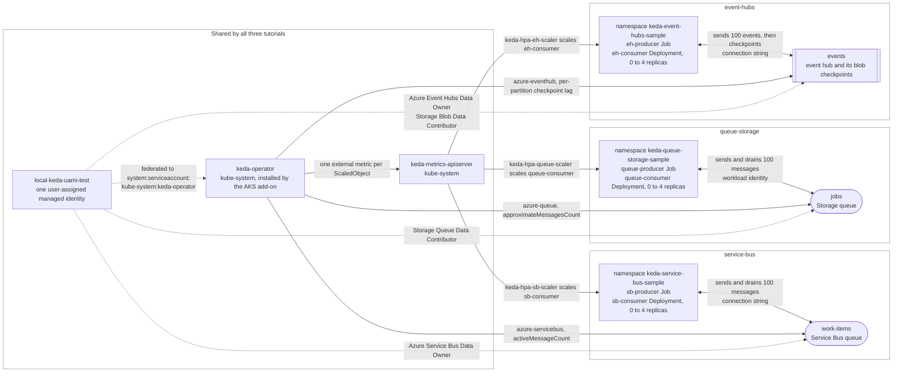

## Event-driven autoscaling on AKS with the KEDA add-on

[Kubernetes Event-driven Autoscaling (KEDA)](https://keda.sh/) scales a workload on the amount of work waiting for it rather than on CPU or memory, and it can scale a workload all the way down to zero replicas when there is nothing to do. On [Azure Kubernetes Service (AKS)](https://learn.microsoft.com/en-us/azure/aks/what-is-aks) KEDA is available as a [managed add-on](https://learn.microsoft.com/en-us/azure/aks/keda-about): when a cluster is created or updated with `--enable-keda`, AKS installs and maintains the KEDA operator, metrics API server and admission webhooks in the `kube-system` namespace, and exposes the state through `properties.workloadAutoScalerProfile.keda.enabled`.

These three tutorials each deploy a Python producer and a Python consumer as container images, and let KEDA scale the consumer from zero replicas up to four and back to zero as the producer fills an Azure event source and the consumer drains it. They differ only in that event source, so reading them side by side shows what changes between scalers and what does not. They run unchanged against Azure in the cloud and against the [LocalStack for Azure](https://docs.localstack.cloud/azure/) emulator.

| Tutorial | Event source | Trigger | Authentication |
| --- | --- | --- | --- |
| [service-bus](service-bus/) | An [Azure Service Bus](https://learn.microsoft.com/en-us/azure/service-bus-messaging/service-bus-messaging-overview) queue | [`azure-servicebus`](https://keda.sh/docs/2.20/scalers/azure-service-bus/) on the queue's active message count | Workload identity for the scaler; connection string for the applications |
| [queue-storage](queue-storage/) | An [Azure Storage](https://learn.microsoft.com/en-us/azure/storage/queues/storage-queues-introduction) queue | [`azure-queue`](https://keda.sh/docs/2.20/scalers/azure-storage-queue/) on the queue's approximate message count | Workload identity end to end, for the scaler **and** both applications |
| [event-hubs](event-hubs/) | An [Azure Event Hubs](https://learn.microsoft.com/en-us/azure/event-hubs/event-hubs-about) hub | [`azure-eventhub`](https://keda.sh/docs/2.20/scalers/azure-event-hub/) on the per-partition lag, computed from blob checkpoints | Connection strings for the scaler and the applications |

Start with [service-bus](service-bus/) if you are new to KEDA: it is the scenario the Microsoft tutorial [Securely scale your applications using the KEDA add-on and workload identity](https://learn.microsoft.com/en-us/azure/aks/keda-workload-identity) describes. Read [queue-storage](queue-storage/) to see [Microsoft Entra Workload ID](https://learn.microsoft.com/en-us/azure/aks/workload-identity-overview) used for the applications as well, with no data-plane secret anywhere. Read [event-hubs](event-hubs/) to see a checkpoint-based scaler, where the backlog is not a queue depth but the distance between the last enqueued event and what the consumer group has checkpointed.

> **Running on LocalStack?** Install the [lstk CLI](https://docs.localstack.cloud/aws/developer-tools/running-localstack/lstk/) and run `lstk az start-interception` to route Azure CLI calls to the emulator. See [Run against LocalStack](../../README.md#run-against-localstack) for the full setup.

## Architecture

The KEDA add-on and the managed identity exist once per cluster, and each tutorial adds its own namespace, event source and role assignment on top of them:



## One shared managed identity

The `keda-operator` service account exists once, in `kube-system`, and the annotation that binds it to a managed identity therefore applies cluster-wide. So the three tutorials deliberately share a single user-assigned managed identity, `local-keda-uami-test`, declared in [00-variables.sh](00-variables.sh):

- Whichever tutorial you run first creates the identity, federates it to `system:serviceaccount:kube-system:keda-operator`, annotates the operator's service account and restarts the operator.
- The other two find the identity, the federated credential and the binding already in place and leave them alone, so all three tutorials can be deployed on the same cluster at the same time.
- Each tutorial grants that identity only the roles its own event source needs, always on the identity's principal (object) id.
- The cleanup scripts remove their own namespace but leave the shared identity, its role assignments and the operator binding in place, because the sibling tutorials use them. Remove them with `az group delete --name local-rg` when you are finished with all three.

## Prerequisites

- An AKS cluster reachable through `kubectl`, created with [scripts/01-user-assigned-managed-identity.sh](../../scripts/01-user-assigned-managed-identity.sh) (or the system-assigned variant). Those scripts already pass `--enable-keda`, `--enable-oidc-issuer` and `--enable-workload-identity`, and they create the `localacrtest` container registry attached to the cluster, which is where these tutorials push their images.
- The values in [00-variables.sh](00-variables.sh) must match the cluster those scripts create (cluster `local-aks-test`, resource group `local-rg`, registry `localacrtest`, location `ItalyNorth`); edit them if you changed their `prefix`, `suffix` or `location`.
- [Azure CLI](https://learn.microsoft.com/en-us/cli/azure/install-azure-cli), [kubectl](https://kubernetes.io/docs/tasks/tools/), [Docker](https://docs.docker.com/get-docker/) and [yq](https://github.com/mikefarah/yq).

Each tutorial's own README lists its scripts in order and explains what to expect from each one. Every script is idempotent, so a script can be re-run safely, and each tutorial ends with an assertion script that proves the scale-out and the scale-in actually happened instead of just printing state.

## Running the three tutorials at once

[run-producers.sh](run-producers.sh) submits messages to all three event sources in parallel, so the three consumer Deployments scale out and fall back to zero side by side and the whole story fits in a single [k9s](https://k9scli.io/) pane instead of three sequential runs.

It assumes the work each tutorial does up front has already been done: the Azure resources provisioned and the consumer application deployed, each in its own namespace. Run `02-create-managed-identity.sh` through `06-deploy-consumer.sh` in all three tutorials first. The script verifies that each consumer Deployment exists before sending anything, and names the `06-deploy-consumer.sh` to run if one is missing, so a backlog is never left with nothing listening to it.

It invokes the tutorials rather than reproducing them. Each `07-run-producer.sh` sources its own `00-variables.sh` through a relative path and applies manifests from its own folder, so the launcher runs each one in a subshell with that folder as the working directory. Message counts, producer images and manifests stay owned by the tutorials: change one and the launcher picks it up unedited.

The three producers finish within about a second of each other, so the three backlogs land together and the deployments ramp in lockstep:

| Elapsed | `eh-consumer` | `queue-consumer` | `sb-consumer` |
| --- | --- | --- | --- |
| 0s | 0/0 | 0/0 | 0/0 |
| 30s | 4/4 | 4/4 | 4/4 |
| 75s | 0/0 | 0/0 | 0/0 |

The launcher itself returns after about fifteen seconds, with the deployments already at one or two replicas, which leaves time to switch to a watch. It prints both on exit:

```bash
k9s -A -c deployments        # then filter with: /consumer
watch -n 1 'kubectl get deployment --all-namespaces | grep -- -consumer'
```

A single filter covers all three namespaces because `eh-consumer`, `queue-consumer` and `sb-consumer` are the only Deployments whose name ends in `-consumer`.

Output is captured per tutorial rather than printed live, since three producers writing to one terminal interleave into noise, and replayed afterwards as one line each on success or the whole log for any producer that failed. `08-watch-scaling.sh` is deliberately not run: it asserts the same scale-out the watch is already showing, and it would narrate over the demo for several minutes. Run it per tutorial when you want the assertions rather than the visual.

## Listing everything the tutorials created

[list-resources.sh](list-resources.sh) prints every Azure resource the three tutorials provision, in one pass: the resource group, the AKS cluster, the Event Hubs namespace and its hub, the storage account holding the Event Hubs checkpoints, the Queue Storage account and its queue, and the Service Bus namespace and its queue.

**It assumes all three tutorials have been deployed.** Every section addresses a resource by name, so a tutorial you have not provisioned yet is reported by the Azure CLI as not found rather than skipped. Run `02-create-managed-identity.sh` through `06-deploy-consumer.sh` in all three tutorials first, exactly as [run-producers.sh](run-producers.sh) expects.

Like the launcher, it resolves its own location, so it can be run from anywhere:

```bash
./tutorials/keda/list-resources.sh
```

Unlike the launcher, it needs the three tutorials' variables in one shell at the same time, and those files do not use disjoint names. `STORAGE_ACCOUNT_NAME` means the checkpoint account in [event-hubs](event-hubs/) and the queue account in [queue-storage](queue-storage/), and `ROLE`, `SECRET_NAME` and `TRIGGER_AUTHENTICATION_NAME` are each defined by two tutorials, so whatever is sourced last would silently win. The script therefore snapshots each diverging value under a tutorial-specific name immediately after sourcing its file. Keep that in mind if you write your own cross-tutorial script: either source in a subshell, as the launcher does, or snapshot before the next `source` overwrites what you need.

## Resources

- [KEDA](https://keda.sh/) and its [Azure scalers](https://keda.sh/docs/2.20/scalers/)
- [Simplified application autoscaling with the KEDA add-on on AKS](https://learn.microsoft.com/en-us/azure/aks/keda-about)
- [Install the KEDA add-on using the Azure CLI](https://learn.microsoft.com/en-us/azure/aks/keda-deploy-add-on-cli)
- [Securely scale your applications using the KEDA add-on and workload identity](https://learn.microsoft.com/en-us/azure/aks/keda-workload-identity)
- [Integrations with KEDA on AKS](https://learn.microsoft.com/en-us/azure/aks/keda-integrations)
- [Troubleshoot the KEDA add-on](https://learn.microsoft.com/en-us/troubleshoot/azure/azure-kubernetes/extensions/troubleshoot-kubernetes-event-driven-autoscaling-add-on)
- [LocalStack for Azure](https://docs.localstack.cloud/azure/)
