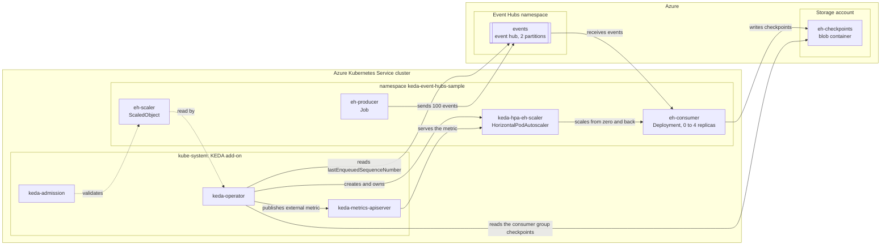

## Event-driven autoscaling on AKS with KEDA and Azure Event Hubs

[KEDA](https://keda.sh/) is a Kubernetes event-driven autoscaler: it watches an external source, publishes what it sees as an external metric, and drives a [HorizontalPodAutoscaler](https://kubernetes.io/docs/tasks/run-application/horizontal-pod-autoscale/) from it, including the scale-to-zero the HPA cannot do on its own. On AKS it is installed and managed by the cluster through the [KEDA add-on](https://learn.microsoft.com/en-us/azure/aks/keda-about).

[Azure Event Hubs](https://learn.microsoft.com/en-us/azure/event-hubs/event-hubs-about) is a partitioned, append-only log. Unlike a queue, consumers do not remove events: each consumer group keeps a cursor per partition, and reading advances that cursor. There is consequently no message count to scale on, which is why the [KEDA azure-eventhub scaler](https://keda.sh/docs/2.20/scalers/azure-event-hub/) works from checkpoints instead: it computes, per partition, the last enqueued sequence number minus the sequence number stored in the consumer group's checkpoint, and scales on that lag.

This tutorial creates an Event Hubs namespace with one event hub, a dedicated consumer group, and a storage account whose blob container holds that consumer group's checkpoints. It then deploys a Python consumer that starts at **zero replicas**, and a producer that runs as a Kubernetes `Job` and sends a burst of events. KEDA observes the lag, activates the consumer, scales it out while it catches up, and returns it to zero when it has. Everything runs unchanged against a real AKS cluster and against the [LocalStack for Azure](https://docs.localstack.cloud/azure/) emulator.

> **Running on LocalStack?** Install the [lstk CLI](https://docs.localstack.cloud/aws/developer-tools/running-localstack/lstk/) and run `lstk az start-interception` to route Azure CLI calls to the emulator. See [Run against LocalStack](../../../README.md#run-against-localstack) for the full setup.

## Architecture

The producer and the consumer are two workloads in the same Kubernetes namespace inside the AKS cluster. The producer sends events to the event hub, the consumer reads them and records its progress as checkpoints in blob storage, and the KEDA add-on in `kube-system` compares the two to work out the lag that drives the scaling.



## Prerequisites

- An AKS cluster reachable through `kubectl`, created with [scripts/01-user-assigned-managed-identity.sh](../../../scripts/01-user-assigned-managed-identity.sh) (or the system-assigned variant). The values in [../00-variables.sh](../00-variables.sh) (cluster `local-aks-test`, resource group `local-rg`, location `ItalyNorth`) must match the cluster the script creates; edit them if you changed the cluster script's `prefix`, `suffix`, or `location`.
- An Azure Container Registry attached to the cluster. The cluster-creation script creates it and attaches it with `--attach-acr`, which is why the manifests need no image pull secret.
- [Azure CLI](https://learn.microsoft.com/en-us/cli/azure/install-azure-cli) (`az`), [kubectl](https://kubernetes.io/docs/tasks/tools/), [yq](https://mikefarah.gitbook.io/yq/) to patch the manifests, and [Docker](https://docs.docker.com/get-docker/) to build the two images.

The cluster-creation scripts already pass `--enable-keda` and `--enable-oidc-issuer`, so `01-enable-keda.sh` is idempotent: on such a cluster it detects the add-on and leaves it in place. It still runs cleanly on a cluster created without it, enabling it through the live `az aks update` path.

The three KEDA tutorials (`service-bus`, `queue-storage`, `event-hubs`) share one user-assigned managed identity, defined in [../00-variables.sh](../00-variables.sh). The `keda-operator` service account exists once, in `kube-system`, so a single shared identity is what lets them coexist on the same cluster: whichever tutorial you run first creates the identity and annotates the operator, and the others find both already in place.

### Kubernetes manifests

Every manifest in [scripts/](scripts/) is valid, applyable YAML whose environment-specific fields are empty strings or placeholders; the deploy scripts fill them in with `yq`, which is why the same files work against the emulator and against Azure without edits. Note what is missing: there is no `triggerauthentication.yml`, because this trigger reads its connection strings from the scale target's environment instead of authenticating as an identity.

| Manifest | What it creates | Filled in at apply time |
| --- | --- | --- |
| `namespace.yml` | The `keda-event-hubs-sample` namespace that holds everything else. | The namespace name. |
| `configmap.yml` | `eh-app-config`, the non-secret settings both applications read as environment variables. | The event hub name, the consumer group, the checkpoint container, the message count and the seconds of work per event. |
| `secret.yml` | `eh-connection`, holding the event hub and storage connection strings. Its key names are what the trigger's `connectionFromEnv` and `storageConnectionFromEnv` refer to, so they must not drift. | Both connection strings, base64 encoded and used verbatim as Azure returned them. |
| `deployment.yml` | `eh-consumer`, the workload KEDA scales, at `replicas: 0`. | The consumer image (from the registry's login server), the pull policy, and the config map and secret names. |
| `scaledobject.yml` | `eh-scaler`, the trigger and the scaling bounds. KEDA turns it into the `keda-hpa-eh-scaler` autoscaler. | The consumer group, the unprocessed-event threshold, the checkpoint container, and the polling, cooldown and replica bounds. |
| `producer-job.yml` | `eh-producer`, the `Job` that sends the events. | The producer image, the pull policy, and the config map and secret names. |

### Applications

The producer and the consumer are separate Python applications with their own dependencies and their own image, built from `src/` and pushed to the registry attached to the cluster.

| Path | What it is |
| --- | --- |
| `src/producer/producer.py` | Sends `MESSAGE_COUNT` events in batches with `EventHubProducerClient`, spreading them across the hub's partitions, then exits 0 so the `Job` completes. |
| `src/consumer/consumer.py` | Receives events with `EventHubConsumerClient` and a `BlobCheckpointStore`, spends `WORK_SECONDS` on each one and checkpoints it. The checkpoint is the load-bearing part: it is the write the scaler reads to compute the lag, so without it the workload would never scale back to zero. A failed checkpoint write is logged and the events are re-read rather than crashing the pod. |
| `src/producer/requirements.txt` | The pinned `azure-eventhub` dependency. |
| `src/consumer/requirements.txt` | `azure-eventhub` plus `azure-eventhub-checkpointstoreblob` for the blob checkpoint store. |
| `src/{producer,consumer}/Dockerfile` | Two-stage build on `python:3.13-slim` that installs the dependencies into a virtual environment and runs as a non-root user. |

## How it works

Run the numbered scripts in order. Each one sources [00-variables.sh](scripts/00-variables.sh) and is idempotent, so it can be re-run safely.

| Script | What it does | Expected result |
| --- | --- | --- |
| `00-variables.sh` | Sources the shared [../00-variables.sh](../00-variables.sh), then adds the Event Hubs names (namespace, hub, partition count, consumer group, authorization rule), the checkpoint storage account and container, the two roles, the image names, and the Kubernetes object names. Sourced by every script, never run directly. | Variables set. |
| `01-enable-keda.sh` | Enables the KEDA add-on on the cluster (`az aks update --enable-keda`), merges the cluster credentials into `kubeconfig` (the only script that does, so run it first), and waits for the `scaledobjects.keda.sh` CRD. | The CRD is `Established` and the installed KEDA version is printed. |
| `02-create-managed-identity.sh` | Creates the shared user-assigned managed identity, federates it to `system:serviceaccount:kube-system:keda-operator`, annotates that service account with the identity's **client id**, and restarts the operator so the workload-identity variables are injected. | The identity and its federated credential exist; the operator is bound to it and ready. The add-on's components are listed at the end. |
| `03-create-resources.sh` | Creates the Event Hubs namespace, the event hub with `2` partitions, the `keda-cg` consumer group, a hub-level authorization rule with `Listen Send Manage`, the storage account, and the `eh-checkpoints` blob container. Then grants the identity's **principal id** `Azure Event Hubs Data Owner` on the namespace and `Storage Blob Data Contributor` on the storage account. | All six resources exist and both role assignments are in place. |
| `04-build-docker-images.sh` | Builds the producer and consumer images from `../src/producer` and `../src/consumer`. | Both images are built locally. |
| `05-push-docker-images.sh` | Logs in to the registry, reads its login server with `az acr show --query loginServer`, then tags and pushes both images. | Both images are in the registry. |
| `06-deploy-consumer.sh` | Creates the namespace, the config map, and the secret holding the two connection strings, deploys the consumer at `0` replicas, and applies the `ScaledObject`. | KEDA creates the `keda-hpa-eh-scaler` autoscaler and the deployment stays at zero replicas. |
| `07-run-producer.sh` | Deletes any previous producer `Job`, then runs the producer, which sends `100` events in batches of `20`. | The `Job` completes and the events are in the hub. |
| `08-watch-scaling.sh` | Asserts that KEDA owns the workload, that the consumer scaled out to at least `2` ready replicas, that it wrote checkpoint blobs, and that it scaled back to zero. | Four `PASS` lines and a `SUCCESS` summary; any failure dumps the `ScaledObject`, the HPA, the pods, the events and the operator log. |
| `09-cleanup.sh` | Deletes the sample namespace. Pass `--disable-keda` to also turn the add-on off on the cluster. | The sample resources are removed; the shared identity is deliberately left in place. |

```bash
cd keda/event-hubs/scripts
./01-enable-keda.sh
./02-create-managed-identity.sh
./03-create-resources.sh
./04-build-docker-images.sh
./05-push-docker-images.sh
./06-deploy-consumer.sh
./07-run-producer.sh
./08-watch-scaling.sh
# ./09-cleanup.sh                # when finished
# ./09-cleanup.sh --disable-keda # also remove the KEDA add-on
```

### Scaling on a cursor, not on a backlog

Event Hubs has no `activeMessageCount`. The `azure-eventhub` trigger derives the metric itself:

1. it reads the **last enqueued sequence number** of each partition from the event hub;
2. it reads the **checkpoint** of the configured consumer group for that partition from the `blobContainer` in the storage account;
3. the difference is the number of unprocessed events on that partition, and their sum, divided by the current replica count, is the metric the HPA compares against `unprocessedEventThreshold`.

Three consequences shape this tutorial:

- **The consumer must checkpoint.** `consumer.py` calls `partition_context.update_checkpoint(event)` for every event it processes. A consumer that only reads leaves the lag at its peak forever, and the deployment never scales back to zero. This is why `08-watch-scaling.sh` asserts on the checkpoint blobs rather than on a drained backlog: they are the scaler's actual input.
- **The container must exist before the consumer starts.** `BlobCheckpointStore` does not create it, so `03-create-resources.sh` does, well before the `ScaledObject` can activate the deployment.
- **`checkpointStrategy` must match the writer.** `blobMetadata` is the format written by the modern Python, C#, Java, and JavaScript SDKs, which is what [azure-eventhub-checkpointstoreblob](https://pypi.org/project/azure-eventhub-checkpointstoreblob/) produces. A mismatched strategy makes the scaler look for checkpoints that are not there and report the full lag.

Note also that Event Hubs assigns each partition to one consumer at a time. With `2` partitions, at most two replicas receive events; the extra replicas the HPA creates stay idle until a partition is released. The partition count, not `maxReplicaCount`, is the real ceiling on useful parallelism.

### Why this tutorial uses connection strings everywhere

In the `service-bus` tutorial only the applications use a connection string: the scaler authenticates with [Microsoft Entra Workload ID](https://learn.microsoft.com/en-us/azure/aks/workload-identity-overview) through a `TriggerAuthentication`, because it reads the queue's message count over the HTTPS management API.

Here **both** the scaler and the applications use connection strings, and there is no `TriggerAuthentication` at all:

- the `azure-eventhub` scaler and the Event Hubs SDKs reach the hub over **AMQP**, not over an HTTPS management API;
- the LocalStack emulator's AMQP listener is **plain TCP**, which is what its connection strings signal with `UseDevelopmentEmulator=true`, and that mode has no Microsoft Entra variant.

So the trigger takes its credentials from the scale target's own environment, with `connectionFromEnv: EVENTHUB_CONNECTION` and `storageConnectionFromEnv: STORAGE_CONNECTION`. Those two names are contractual: they are the keys of the `eh-connection` secret, which reaches the consumer container through `envFrom`. Rename one without renaming the other and the scaler reports a configuration error instead of a metric.

Both connection strings are used **verbatim as returned by Azure**, and both are read at runtime rather than hardcoded. The Event Hubs one carries the `sb://` scheme, `UseDevelopmentEmulator=true`, and the emulator's dynamic port; rewriting any of that makes the SDK force TLS on port `5671`, which the emulator's plain-TCP listener does not serve. The hub-level authorization rule also embeds `EntityPath=<hub>`, which is what tells the scaler which hub to read without any extra trigger metadata.

`03-create-resources.sh` still creates the shared managed identity's two grants, `Azure Event Hubs Data Owner` on the namespace and `Storage Blob Data Contributor` on the storage account. They are **not** exercised by the connection-string path this tutorial takes. They are there so that, against real Azure, you can switch the trigger to workload identity by adding a `TriggerAuthentication` with `podIdentity.provider: azure-workload` (exactly as the `service-bus` tutorial does), replacing `connectionFromEnv` and `storageConnectionFromEnv` with `eventHubNamespace`, `eventHubName`, and `blobContainer`, and referencing it from the trigger.

**Why the ramp is gradual.** Left to its defaults the autoscaler may add four replicas, or double the count, every fifteen seconds. With a backlog of `MESSAGE_COUNT` messages against a per-replica target of `SCALING_THRESHOLD`, the computed target is far above `MAX_REPLICAS`, so the default policy would jump straight to the cap in one step and there would be no ramp to watch. The `ScaledObject` therefore sets an explicit `scaleUp` policy of `SCALE_UP_PODS` replica per `SCALE_UP_PERIOD_SECONDS` seconds, so the scale-out is visible as `0 -> 1 -> 2 -> 3 -> 4`. Scale-in is left aggressive on purpose: once the backlog is gone there is nothing to be gradual about. Both knobs live in [../00-variables.sh](../00-variables.sh), and [08-watch-scaling.sh](scripts/08-watch-scaling.sh) records the observed steps and fails if the deployment reaches the cap in a single one.

## Resources

- [Azure Event Hubs documentation](https://learn.microsoft.com/en-us/azure/event-hubs/event-hubs-about)
- [Features and terminology in Azure Event Hubs](https://learn.microsoft.com/en-us/azure/event-hubs/event-hubs-features)
- [Balance partition load across multiple instances](https://learn.microsoft.com/en-us/azure/event-hubs/event-processor-balance-partition-load)
- [Authenticate an application to access Azure Event Hubs resources](https://learn.microsoft.com/en-us/azure/event-hubs/authenticate-application)
- [KEDA azure-eventhub scaler](https://keda.sh/docs/2.20/scalers/azure-event-hub/)
- [Simplified application autoscaling with the KEDA add-on (AKS)](https://learn.microsoft.com/en-us/azure/aks/keda-about)
- [Integrate KEDA with workload identity on AKS](https://learn.microsoft.com/en-us/azure/aks/keda-workload-identity)
- [azure-eventhub for Python](https://learn.microsoft.com/en-us/python/api/overview/azure/eventhub-readme)
- [Horizontal Pod Autoscaling (Kubernetes documentation)](https://kubernetes.io/docs/tasks/run-application/horizontal-pod-autoscale/)
- [LocalStack for Azure](https://docs.localstack.cloud/azure/)
