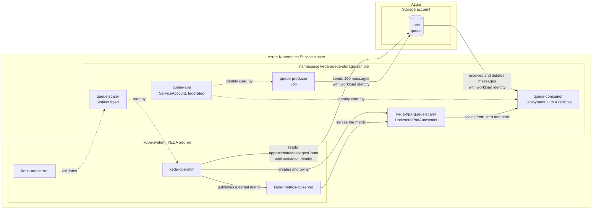

## Azure Storage Queue autoscaling on AKS with KEDA and Microsoft Entra Workload ID

[KEDA](https://keda.sh/) is a Kubernetes event-driven autoscaler: it reads a metric from an external system, exposes it through the Kubernetes external metrics API, and drives a [HorizontalPodAutoscaler](https://kubernetes.io/docs/tasks/run-application/horizontal-pod-autoscale/) from it, including the scale-to-zero that the HPA cannot do on its own.
On AKS the [KEDA add-on](https://learn.microsoft.com/en-us/azure/aks/keda-about) installs and manages the KEDA operator, its metrics API server and its admission webhooks in `kube-system`, so the cluster comes with a supported KEDA instead of a hand-installed one.

This tutorial scales a Python consumer on the backlog of an [Azure Storage queue](https://learn.microsoft.com/en-us/azure/storage/queues/storage-queues-introduction) with the [KEDA `azure-queue` scaler](https://keda.sh/docs/2.20/scalers/azure-storage-queue/), on an AKS cluster or on the [LocalStack for Azure](https://docs.localstack.cloud/azure/) emulator.
A producer Job sends 100 messages, the `ScaledObject` activates the consumer Deployment from zero, the HPA scales it out towards the `queueLength` target of 5 messages per replica, and the deployment returns to zero once the queue is drained.

It is the only one of the three KEDA tutorials that uses [Microsoft Entra Workload ID](https://learn.microsoft.com/en-us/azure/aks/workload-identity-overview) end to end.
The KEDA scaler **and** both applications authenticate with the same shared user-assigned managed identity, through their own federated identity credentials and their own service accounts, so there is **no connection string and no Kubernetes Secret anywhere in this tutorial**: the only credential is a projected service account token that Kubernetes rotates on its own, and the only Azure grant is one `Storage Queue Data Contributor` role assignment on the storage account.

## Architecture

The producer and the consumer are two workloads in the same Kubernetes namespace inside the AKS cluster, both running as the federated `queue-app` service account. The producer fills the storage queue, the consumer drains it, and the KEDA add-on in `kube-system` reads the queue's depth to decide how many consumer replicas should exist. Every arrow that touches Azure is authenticated with workload identity.



## Prerequisites

- An AKS cluster reachable through `kubectl`, created with [scripts/01-user-assigned-managed-identity.sh](../../../scripts/01-user-assigned-managed-identity.sh) (or the system-assigned variant). The values in [../00-variables.sh](../00-variables.sh) (cluster `local-aks-test`, resource group `local-rg`, location `ItalyNorth`) must match the cluster the script creates; edit them if you changed the cluster script's `prefix`, `suffix`, or `location`. The cluster must have the OIDC issuer and the workload identity webhook enabled, which those scripts do.
- An Azure Container Registry attached to the cluster (`--attach-acr`), also created by the cluster-creation scripts, so the nodes can pull the producer and consumer images without an image pull secret.
- [Azure CLI](https://learn.microsoft.com/en-us/cli/azure/install-azure-cli) (`az`), signed in to the target subscription with `az login`.
- [kubectl](https://kubernetes.io/docs/tasks/tools/) and [yq](https://github.com/mikefarah/yq) (the manifests in `scripts/` are patched with `yq` before they are applied).
- [Docker](https://docs.docker.com/get-docker/) to build the two images.

The cluster-creation scripts already pass `--enable-keda`, so `01-enable-keda.sh` is idempotent: on such a cluster it detects the add-on and leaves it in place. It still runs cleanly on a cluster created without it, enabling it through the live `az aks update` path.

The shared user-assigned managed identity and the `keda-operator` binding are created once and reused by all three KEDA tutorials, so whichever one you run first creates them and the others find them already there.

## Scripts

Run the numbered scripts in order. Each one sources [scripts/00-variables.sh](scripts/00-variables.sh) and is idempotent, so it can be re-run safely.

| Script | What it does | Expected result |
| --- | --- | --- |
| `00-variables.sh` | Sources the [shared KEDA variables](../00-variables.sh) (cluster, registry, shared managed identity, message counts, scaling and polling knobs) and adds the ones specific to this tutorial: the storage account, the `jobs` queue, the `Storage Queue Data Contributor` role, the `queue-app` service account and federated credential, the image names, and the Kubernetes object names. Sourced by every script, never run directly. | Variables exported. |
| `01-enable-keda.sh` | Confirms the cluster exists, enables the KEDA add-on (`az aks update --enable-keda`) when it is not enabled yet, merges the cluster credentials into `kubeconfig` (the only script that does, so run it first), and waits for the `scaledobjects.keda.sh` CRD. | The CRD is `Established` and the installed KEDA version is printed. |
| `02-create-managed-identity.sh` | Gets or creates the shared user-assigned managed identity, then gets or creates **two** federated identity credentials on it: `keda-operator` for `system:serviceaccount:kube-system:keda-operator` and `queue-app` for `system:serviceaccount:keda-queue-storage-sample:queue-app`. Annotates the `keda-operator` service account with the identity's client id and restarts the operator when the annotation changes. | The identity exists, both federated credentials exist, and the KEDA operator runs with the workload-identity variables injected. The add-on's components are listed at the end. |
| `03-create-resources.sh` | Gets or creates the storage account (`StorageV2`, `Standard_LRS`) and the `jobs` queue, then assigns the `Storage Queue Data Contributor` role to the identity's **principal id** on the storage account, with retries. The queue is a data-plane resource, so the CLI authenticates with `--auth-mode login` and falls back to an account key only if that is refused. | The account and the queue exist and the identity holds the role on the account. |
| `04-build-docker-images.sh` | Builds `keda-queue-producer:v1` and `keda-queue-consumer:v1` from `../src/producer` and `../src/consumer`. | Both images are present in the local Docker daemon. |
| `05-push-docker-images.sh` | Reads the registry's login server with `az acr show --query loginServer`, tags both images with it, and pushes them. | Both images are in the registry. |
| `06-deploy-consumer.sh` | Creates the namespace, the `queue-app` service account annotated with the identity's client id and the tenant id, the config map (including the ARM-returned `QUEUE_ENDPOINT`), the consumer Deployment at zero replicas, the `TriggerAuthentication` for workload identity, and the `ScaledObject` with the derived `endpointSuffix`. Waits for KEDA to create the autoscaler. | The `keda-hpa-queue-scaler` autoscaler exists and `queue-consumer` sits at zero replicas. |
| `07-run-producer.sh` | Deletes any previous producer Job, then runs the producer as a Job on the same service account and waits for it to complete. | 100 messages are queued in `jobs` and the Job's last log lines are printed. |
| `08-watch-scaling.sh` | Four checks: the autoscaler exists, the consumer reaches at least 2 ready replicas, the queue drains, and the consumer returns to zero replicas. Dumps the `ScaledObject`, the autoscaler, the pods, the events and the KEDA operator log on any failure. | Four `PASS` lines and a final `SUCCESS` line. |
| `09-cleanup.sh` | Deletes the sample namespace, and with it the Deployment, the Job, the service account, the config map and the KEDA resources. Pass `--disable-keda` to also remove the add-on. The shared identity, its federated credentials and its role assignment are left in place for the other tutorials. | The sample resources are removed. |

```bash
cd keda/queue-storage/scripts
./01-enable-keda.sh
./02-create-managed-identity.sh
./03-create-resources.sh
./04-build-docker-images.sh
./05-push-docker-images.sh
./06-deploy-consumer.sh
./07-run-producer.sh
./08-watch-scaling.sh
# ./09-cleanup.sh                # when finished
# ./09-cleanup.sh --disable-keda # also remove the KEDA add-on
```

### Kubernetes manifests

Every manifest in [scripts/](scripts/) is valid, applyable YAML whose environment-specific fields are empty strings or placeholders; the deploy scripts fill them in with `yq`, which is why the same files work against the emulator and against Azure without edits. Note what is missing: there is no `secret.yml`, because nothing in this tutorial holds a data-plane credential.

| Manifest | What it creates | Filled in at apply time |
| --- | --- | --- |
| `namespace.yml` | The `keda-queue-storage-sample` namespace that holds everything else. | The namespace name. |
| `serviceaccount.yml` | `queue-app`, the service account both applications run as, annotated so the workload-identity webhook projects a token for the shared managed identity. | The identity's client id and the tenant id. |
| `configmap.yml` | `queue-app-config`, the non-secret settings both applications read as environment variables. | The queue endpoint and name, the message count, the seconds of work per message and the batch size. |
| `deployment.yml` | `queue-consumer`, the workload KEDA scales, at `replicas: 0`, labelled `azure.workload.identity/use: "true"` and running as `queue-app`. | The consumer image (from the registry's login server), the pull policy and the config map name. |
| `triggerauthentication.yml` | `queue-trigger-auth`, which tells KEDA to authenticate as the shared managed identity with workload identity. | The managed identity's client id. |
| `scaledobject.yml` | `queue-scaler`, the trigger and the scaling bounds. KEDA turns it into the `keda-hpa-queue-scaler` autoscaler. | The queue and account names, the queue-length threshold, the derived `endpointSuffix`, and the polling, cooldown and replica bounds. |
| `producer-job.yml` | `queue-producer`, the `Job` that fills the queue, with the same workload-identity label and service account as the consumer. | The producer image, the pull policy and the config map name. |

### Applications

The producer and the consumer are separate Python applications with their own dependencies and their own image, built from `src/` and pushed to the registry attached to the cluster.

| Path | What it is |
| --- | --- |
| `src/producer/producer.py` | Sends `MESSAGE_COUNT` messages with `QueueClient` and `DefaultAzureCredential`, so even the producer authenticates with workload identity, then exits 0 so the `Job` completes. |
| `src/consumer/consumer.py` | Receives pages of `BATCH_SIZE` with `DefaultAzureCredential`, spends `WORK_SECONDS` on each message and deletes it. Resilient by design: a message whose visibility timeout expired before it could be deleted is logged and skipped, because storage queues redeliver it, and crashing would stall the backlog instead of draining it. |
| `src/{producer,consumer}/requirements.txt` | The pinned `azure-identity` and `azure-storage-queue` dependencies, installed at image build time. |
| `src/{producer,consumer}/Dockerfile` | Two-stage build on `python:3.13-slim` that installs the dependencies into a virtual environment and runs as a non-root user. |

## How it works

### One identity, three workloads, no secrets

Microsoft Entra Workload ID replaces a stored credential with a trust relationship.
The AKS cluster publishes an OIDC issuer; a **federated identity credential** on a user-assigned managed identity says "a token from this issuer, for this service account subject, with audience `api://AzureADTokenExchange`, may act as me".
The workload identity mutating webhook projects a short-lived service account token into any pod labelled `azure.workload.identity/use: "true"` whose service account is annotated with `azure.workload.identity/client-id`, and sets `AZURE_CLIENT_ID`, `AZURE_TENANT_ID`, `AZURE_AUTHORITY_HOST` and `AZURE_FEDERATED_TOKEN_FILE` on it. `DefaultAzureCredential` finds those four variables and exchanges the projected token for a Microsoft Entra access token, with no secret involved.

This tutorial sets that chain up three times over one identity:

1. **The KEDA operator.** `02-create-managed-identity.sh` creates the `keda-operator` federated credential for `system:serviceaccount:kube-system:keda-operator` and annotates that service account. The `TriggerAuthentication` with `podIdentity.provider: azure-workload` and `identityId` set to the identity's client id tells the scaler to use it.
2. **The consumer.** `06-deploy-consumer.sh` creates the `queue-app` service account with the same client id and the tenant id, and the Deployment's pod template carries the `azure.workload.identity/use: "true"` label and `serviceAccountName: queue-app`.
3. **The producer.** The Job's pod template is identical in that respect, so the producer authenticates the same way.

Authorization is the other half, and it uses a different id: the role assignment in `03-create-resources.sh` is made with `--assignee-object-id` on the identity's **principal (object) id**, never on its client id.
The client id authenticates, the principal id is authorized, and a single `Storage Queue Data Contributor` assignment on the storage account covers all three workloads: reading the queue's message count for the scaler, and adding, reading, updating and deleting messages for the applications.

### Deriving `endpointSuffix` from the ARM endpoint

The `azure-queue` scaler builds its request URL as `https://{accountName}.{endpointSuffix}/{queueName}`, so `endpointSuffix` is the authority of the queue endpoint with the account label removed, and `cloud: Private` is what allows a non-public value.
`06-deploy-consumer.sh` never hardcodes it: it reads `primaryEndpoints.queue` from `az storage account show`, strips the trailing slash that real Azure adds, and uses the result verbatim as the applications' `QUEUE_ENDPOINT`.
For the trigger it then strips the scheme and the path and removes the leading `{account}.` label, keeping the port when one is present:

| Target | `primaryEndpoints.queue` | `endpointSuffix` |
| --- | --- | --- |
| Real Azure | `https://{account}.queue.core.windows.net/` | `queue.core.windows.net` |
| LocalStack | `https://{account}.queue.core.azure.localhost.localstack.cloud:4566` | `queue.core.azure.localhost.localstack.cloud:4566` |

Unlike the Service Bus tutorial, where the AMQP data port in `serviceBusEndpoint` differs from the port that serves the management API, the queue endpoint already carries the port that serves the queue REST API, so no port substitution is needed here.

### Why the deployment scales the way it does

The producer sends `MESSAGE_COUNT` (100) messages and exits.
The consumer receives them in pages of `BATCH_SIZE` (5) with a 60 second visibility timeout, sleeps `WORK_SECONDS` (2) per message, and deletes each one, so a single replica cannot drain the backlog before the HPA observes the metric.
With a `queueLength` target of `SCALING_THRESHOLD` (5) the HPA target is `ceil(backlog / 5)` capped at `MAX_REPLICAS` (4), and `minReplicaCount: 0` plus a `cooldownPeriod` of 30 seconds is what returns the deployment to zero afterwards.
The polling interval, cooldown and scale-down stabilization window are deliberately short so both directions are observable inside a tutorial session; production values are usually much larger.

`08-watch-scaling.sh` reads the remaining backlog with Peek Messages, because the `az` CLI does not surface a queue's approximate message count. Peek sees only visible messages, so the drain check can pass slightly early; the scale-in check is the strict one, since KEDA's own metric is the approximate message count and does include the messages a replica is still holding.

## Resources

- [KEDA](https://keda.sh/) and the [Azure Storage Queue scaler](https://keda.sh/docs/2.20/scalers/azure-storage-queue/)
- [Simplified application autoscaling with the Kubernetes Event-driven Autoscaling (KEDA) add-on](https://learn.microsoft.com/en-us/azure/aks/keda-about)
- [Integrate KEDA with your AKS cluster using workload identity](https://learn.microsoft.com/en-us/azure/aks/keda-workload-identity)
- [Use Microsoft Entra Workload ID with Azure Kubernetes Service (AKS)](https://learn.microsoft.com/en-us/azure/aks/workload-identity-overview)
- [Deploy and configure workload identity on an AKS cluster](https://learn.microsoft.com/en-us/azure/aks/workload-identity-deploy-cluster)
- [What are Azure Storage queues?](https://learn.microsoft.com/en-us/azure/storage/queues/storage-queues-introduction)
- [Assign an Azure role for access to queue data](https://learn.microsoft.com/en-us/azure/storage/queues/assign-azure-role-data-access)
- [Authorize access to queue data with the Azure CLI](https://learn.microsoft.com/en-us/azure/storage/queues/authorize-data-operations-cli)
- [Peek Messages (REST API)](https://learn.microsoft.com/en-us/rest/api/storageservices/peek-messages)
- [Horizontal Pod Autoscaling (Kubernetes documentation)](https://kubernetes.io/docs/tasks/run-application/horizontal-pod-autoscale/)
- [LocalStack for Azure](https://docs.localstack.cloud/azure/)
