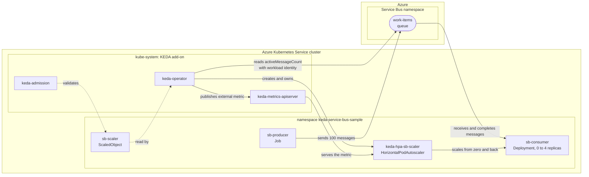

## Autoscale on an Azure Service Bus queue with the AKS KEDA add-on

[Kubernetes Event-driven Autoscaling (KEDA)](https://keda.sh/) scales a workload on the size of the work waiting for it, instead of on CPU or memory. On [Azure Kubernetes Service (AKS)](https://learn.microsoft.com/en-us/azure/aks/what-is-aks) it is available as a [managed add-on](https://learn.microsoft.com/en-us/azure/aks/keda-about): AKS installs and maintains the KEDA operator, metrics API server and admission webhooks in the `kube-system` namespace when the cluster is created or updated with `--enable-keda`.

This tutorial deploys a Python consumer that reads from an [Azure Service Bus](https://learn.microsoft.com/en-us/azure/service-bus-messaging/service-bus-messaging-overview) queue and a Python producer that fills it, then lets KEDA scale the consumer from **zero replicas** up to four and back to zero as the queue fills and drains. It runs unchanged against Azure in the cloud and against the [LocalStack for Azure](https://docs.localstack.cloud/azure/) emulator.

The KEDA operator authenticates to Azure with [Microsoft Entra Workload ID](https://learn.microsoft.com/en-us/azure/aks/workload-identity-overview), following the [KEDA and workload identity tutorial](https://learn.microsoft.com/en-us/azure/aks/keda-workload-identity): a user-assigned managed identity is federated to the `keda-operator` service account, granted the **Azure Service Bus Data Owner** role on the namespace, and referenced from a `TriggerAuthentication`. No secret is involved in the scaling decision.

The producer and consumer applications themselves use the namespace connection string. That is a deliberate difference from the scaler: the applications speak AMQP, and the emulator's AMQP listener is plain TCP (its connection strings carry `UseDevelopmentEmulator=true`), a mode that has no Microsoft Entra variant. The scaler instead reads the queue's message count over the HTTPS management API, where workload identity works on both targets. The sibling [queue-storage](../queue-storage/) tutorial shows workload identity end to end, for the scaler and for the applications.

## Architecture

The producer and the consumer are two workloads in the same Kubernetes namespace inside the AKS cluster. The producer fills the Service Bus queue, the consumer drains it, and the KEDA add-on in `kube-system` reads the queue's depth to decide how many consumer replicas should exist.



## Prerequisites

- An AKS cluster reachable through `kubectl`, created with [scripts/01-user-assigned-managed-identity.sh](../../../scripts/01-user-assigned-managed-identity.sh) (or the system-assigned variant). The values in [../00-variables.sh](../00-variables.sh) (cluster `local-aks-test`, resource group `local-rg`, registry `localacrtest`, location `ItalyNorth`) must match the cluster those scripts create; edit them if you changed their `prefix`, `suffix` or `location`.
- [Azure CLI](https://learn.microsoft.com/en-us/cli/azure/install-azure-cli) (`az`), authenticated with `az login`. Running against LocalStack? Point the CLI at the emulator first, then run the same scripts unchanged.
- [kubectl](https://kubernetes.io/docs/tasks/tools/) and [Docker](https://docs.docker.com/get-docker/) to build and push the two images.
- [yq](https://github.com/mikefarah/yq), used to fill the manifests in with the values from `00-variables.sh`.

The cluster-creation scripts already pass `--enable-keda`, `--enable-oidc-issuer` and `--enable-workload-identity`, so on such a cluster [01-enable-keda.sh](scripts/01-enable-keda.sh) detects the add-on and leaves it in place. It still runs cleanly on a cluster created without it, enabling it through the live `az aks update --enable-keda` path.

## How to run it

Run the numbered scripts in order. Each one sources [00-variables.sh](scripts/00-variables.sh) and is idempotent, so any of them can be re-run safely.

| Script | What it does | Expected result |
| --- | --- | --- |
| `00-variables.sh` | Variables for this tutorial (Service Bus namespace and queue, role, image names, Kubernetes object names). Sources the shared [../00-variables.sh](../00-variables.sh). Sourced by every script, never run directly. | Variables set. |
| `01-enable-keda.sh` | Verifies the cluster exists, enables the KEDA add-on if it is not enabled yet, merges the cluster credentials into `kubeconfig` (the only script that does, so run it first), and waits for the `scaledobjects.keda.sh` CRD. | The CRD is `Established` and the installed KEDA version is printed. |
| `02-create-managed-identity.sh` | Creates (or reuses) the managed identity shared by the three KEDA tutorials, federates it to `system:serviceaccount:kube-system:keda-operator`, annotates that service account with the identity's client id and restarts the operator so the workload-identity variables are injected. | The identity exists, the operator is bound to it, and the add-on's components are listed. The restart is skipped when the annotation is already correct. |
| `03-create-resources.sh` | Creates (or reuses) the Service Bus namespace and the `work-items` queue, then grants the identity the **Azure Service Bus Data Owner** role on the namespace, on its principal (object) id. | The namespace, the queue and the role assignment exist. |
| `04-build-docker-images.sh` | Builds the producer and consumer images from [src/producer](src/producer) and [src/consumer](src/consumer), each of which has its own `Dockerfile`. | Two local images tagged `v1`. |
| `05-push-docker-images.sh` | Logs into the registry, reads its login server, then tags and pushes both images. | Both images are in `localacrtest`. |
| `06-deploy-consumer.sh` | Creates the namespace, the config map and the connection-string secret, then applies the consumer `Deployment` (at zero replicas), the `TriggerAuthentication` and the `ScaledObject`, deriving the image and the trigger's `endpointSuffix` at apply time. | KEDA creates `keda-hpa-sb-scaler` and the consumer sits at zero replicas. |
| `07-run-producer.sh` | Deletes any previous producer `Job`, then runs it to send 100 messages and waits for it to complete. | The Job completes and the queue holds 100 messages. |
| `08-watch-scaling.sh` | Asserts the behaviour: KEDA owns the workload, the consumer scales out from zero to at least two ready replicas, the queue drains, and the consumer scales back to zero. | `PASS` for each check and a final `SUCCESS` line. On failure it dumps the operator log, the `ScaledObject`, the autoscaler and the events. |
| `09-cleanup.sh` | Deletes the tutorial namespace. With `--disable-keda` it also turns the add-on off on the cluster. | The namespace is gone; the shared identity and the operator binding are left for the other tutorials. |

```bash
cd keda/service-bus/scripts
./01-enable-keda.sh
./02-create-managed-identity.sh
./03-create-resources.sh
./04-build-docker-images.sh
./05-push-docker-images.sh
./06-deploy-consumer.sh
./07-run-producer.sh
./08-watch-scaling.sh
# ./09-cleanup.sh                 # when finished
# ./09-cleanup.sh --disable-keda   # also remove the KEDA add-on
```

### Kubernetes manifests

Every manifest in [scripts/](scripts/) is valid, applyable YAML whose environment-specific fields are empty strings or placeholders; the deploy scripts fill them in with `yq`, which is why the same files work against the emulator and against Azure without edits.

| Manifest | What it creates | Filled in at apply time |
| --- | --- | --- |
| `namespace.yml` | The `keda-service-bus-sample` namespace that holds everything else. | The namespace name. |
| `configmap.yml` | `sb-app-config`, the non-secret settings both applications read as environment variables. | The queue name, the message count, the seconds of work per message and the batch size. |
| `secret.yml` | `sb-connection`, holding the Service Bus namespace connection string. | The connection string returned by `az servicebus namespace authorization-rule keys list`, base64 encoded and used verbatim. |
| `deployment.yml` | `sb-consumer`, the workload KEDA scales, at `replicas: 0`. | The consumer image (from the registry's login server), the pull policy, and the config map and secret names. |
| `triggerauthentication.yml` | `sb-trigger-auth`, which tells KEDA to authenticate as the shared managed identity with workload identity. | The managed identity's client id. |
| `scaledobject.yml` | `sb-scaler`, the trigger and the scaling bounds. KEDA turns it into the `keda-hpa-sb-scaler` autoscaler. | The queue and namespace names, the message-count threshold, the derived `endpointSuffix`, and the polling, cooldown and replica bounds. |
| `producer-job.yml` | `sb-producer`, the `Job` that fills the queue. | The producer image, the pull policy, and the config map and secret names. |

### Applications

The producer and the consumer are separate Python applications with their own dependencies and their own image, built from `src/` and pushed to the registry attached to the cluster.

| Path | What it is |
| --- | --- |
| `src/producer/producer.py` | Sends `MESSAGE_COUNT` messages to the queue in batches with `ServiceBusClient`, logs its progress, and exits 0 so the `Job` completes. |
| `src/consumer/consumer.py` | Receives batches of `BATCH_SIZE`, spends `WORK_SECONDS` on each message and completes it. Deliberately resilient: a message whose lock is lost or whose AMQP link drops before it is settled is logged and skipped (Service Bus redelivers it), and a receiver failure reconnects rather than exiting, because a crash-looping consumer would burn the queue's `maxDeliveryCount` and dead-letter the backlog instead of processing it. |
| `src/{producer,consumer}/requirements.txt` | The pinned `azure-servicebus` dependency, installed at image build time so the pods start immediately. |
| `src/{producer,consumer}/Dockerfile` | Two-stage build on `python:3.13-slim` that installs the dependencies into a virtual environment and runs as a non-root user. |

## How it works

**The scaling loop.** The `ScaledObject` names the consumer `Deployment` as its target and declares one `azure-servicebus` trigger with `messageCount: "5"`. The KEDA operator polls the queue's active message count every five seconds. While the queue is empty the Deployment stays at zero replicas. As soon as messages appear the operator activates it to one replica and publishes the count as an external metric, and the HorizontalPodAutoscaler that KEDA created (`keda-hpa-sb-scaler`) raises the replica count toward `ceil(messages / 5)`, capped at `maxReplicaCount: 4`. When the queue is empty again the autoscaler scales the Deployment back to zero after the `cooldownPeriod`.

The producer sends 100 messages and each consumer replica sleeps two seconds per message, so a single replica cannot drain the backlog before the autoscaler reacts. That is what makes the scale-out observable rather than a race.

**Why the ramp is gradual.** Left to its defaults the autoscaler may add four replicas, or double the count, every fifteen seconds. With a backlog of `MESSAGE_COUNT` messages against a per-replica target of `SCALING_THRESHOLD`, the computed target is far above `MAX_REPLICAS`, so the default policy would jump straight to the cap in one step and there would be no ramp to watch. The `ScaledObject` therefore sets an explicit `scaleUp` policy of `SCALE_UP_PODS` replica per `SCALE_UP_PERIOD_SECONDS` seconds, so the scale-out is visible as `0 -> 1 -> 2 -> 3 -> 4`. Scale-in is left aggressive on purpose: once the backlog is gone there is nothing to be gradual about. Both knobs live in [../00-variables.sh](../00-variables.sh), and [08-watch-scaling.sh](scripts/08-watch-scaling.sh) records the observed steps and fails if the deployment reaches the cap in a single one.

**How the operator authenticates.** The identity is federated to the operator's service account, so the operator exchanges its projected service-account token for a Microsoft Entra token for that identity, and the **Azure Service Bus Data Owner** role assignment on the namespace is what authorizes the read. The role assignment is made on the identity's principal (object) id, never on its client id: the client id identifies the identity while it authenticates, the principal id is what Azure authorizes. The `TriggerAuthentication` carries the client id, and `kubectl rollout restart` is required after annotating the service account because the workload-identity variables are injected only when the pods start.

**Why the trigger carries `cloud: Private` and an `endpointSuffix`.** The scaler reads the message count over the HTTPS management API. On real Azure that API answers at `{namespace}.servicebus.windows.net:443`, and on the emulator it answers through the gateway. [06-deploy-consumer.sh](scripts/06-deploy-consumer.sh) therefore derives the suffix at apply time: the host comes from the ARM-returned `serviceBusEndpoint`, and the port comes from the ARM endpoint itself, because the management API is served on the same port as ARM while the `serviceBusEndpoint` port is the AMQP data port. A custom suffix is only accepted together with `cloud: Private`.

**Why the manifests contain empty values.** Every `.yml` in [scripts/](scripts/) is valid, applyable YAML whose environment-specific fields are empty strings or placeholders. The deploy scripts fill them in with `yq` from the values in `00-variables.sh` and from what Azure returns, which is why the same files work against the emulator and against Azure without edits.

## Resources

- [KEDA](https://keda.sh/) and the [Azure Service Bus scaler](https://keda.sh/docs/2.20/scalers/azure-service-bus/)
- [Simplified application autoscaling with the KEDA add-on on AKS](https://learn.microsoft.com/en-us/azure/aks/keda-about)
- [Install the KEDA add-on using the Azure CLI](https://learn.microsoft.com/en-us/azure/aks/keda-deploy-add-on-cli)
- [Securely scale your applications using the KEDA add-on and workload identity](https://learn.microsoft.com/en-us/azure/aks/keda-workload-identity)
- [Microsoft Entra Workload ID on AKS](https://learn.microsoft.com/en-us/azure/aks/workload-identity-overview)
- [Azure Service Bus queues](https://learn.microsoft.com/en-us/azure/service-bus-messaging/service-bus-queues-topics-subscriptions)
- [Kubernetes Jobs](https://kubernetes.io/docs/concepts/workloads/controllers/job/) and [HorizontalPodAutoscaler](https://kubernetes.io/docs/tasks/run-application/horizontal-pod-autoscale/)
- [LocalStack for Azure](https://docs.localstack.cloud/azure/)
