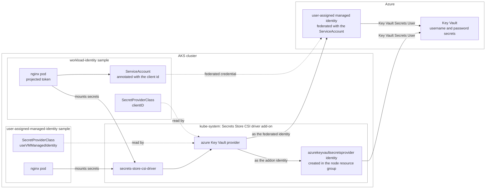

## Azure Key Vault Provider for Secrets Store CSI Driver in AKS

The [Azure Key Vault provider for Secrets Store CSI Driver](https://learn.microsoft.com/en-us/azure/aks/csi-secrets-store-driver) enables retrieving secrets, keys, and certificates stored in Azure Key Vault and accessing them as files from mounted volumes in an AKS cluster. This method eliminates the need for Azure-specific libraries to access the secrets.

This [Secret Store CSI Driver for Key Vault](https://github.com/Azure/secrets-store-csi-driver-provider-azure) offers the following features:

- Mounts secrets, keys, and certificates to a pod using a CSI volume.
- Supports CSI inline volumes.
- Allows the mounting of multiple secrets store objects as a single volume.
- Offers pod portability with the SecretProviderClass CRD.
- Compatible with Windows containers.
- Keeps in sync with Kubernetes secrets.
- Supports auto-rotation of mounted contents and synced Kubernetes secrets.

When auto-rotation is enabled for the Azure Key Vault Secrets Provider, it automatically updates both the pod mount and the corresponding Kubernetes secret defined in the **secretObjects** field of SecretProviderClass. It continuously polls for changes based on the rotation poll interval (default is two minutes).

If a secret in an external secrets store is updated after the initial deployment of the pod, both the Kubernetes Secret and the pod mount will periodically update, depending on how the application consumes the secret data. Here are the recommended approaches for different scenarios:

1. Mount the Kubernetes Secret as a volume: Utilize the auto-rotation and sync K8s secrets features of Secrets Store CSI Driver. The application should monitor changes from the mounted Kubernetes Secret volume. When the CSI Driver updates the Kubernetes Secret, the volume contents will be automatically updated.
2. Application reads data from the container filesystem: Take advantage of the rotation feature of Secrets Store CSI Driver. The application should monitor file changes from the volume mounted by the CSI driver.
3. Use the Kubernetes Secret for an environment variable: Restart the pod to acquire the latest secret as an environment variable. You can use tools like Reloader to watch for changes on the synced Kubernetes Secret and perform rolling upgrades on pods.

### Advantages

- Secrets, keys, and certificates can be accessed as files from mounted volumes.
- Optionally, Kubernetes secrets can be created to store keys, secrets, and certificates from Key Vault.
- No need for Azure-specific libraries to access secrets.
- Simplifies secret management with transparent integration.

### Disadvantages

- Still requires accessing managed services such as Azure Service Bus or Azure Storage using their own connection strings from Azure Key Vault.
- Cannot utilize Microsoft Entra ID integrated security and managed identities for accessing managed services.

> **Running on LocalStack?** Install the [lstk CLI](https://docs.localstack.cloud/aws/developer-tools/running-localstack/lstk/) and run `lstk az start-interception` to route Azure CLI calls to the emulator. See [Run against LocalStack](../../README.md#run-against-localstack) for the full setup.

## Architecture

Both samples mount the same Key Vault secrets into a pod; they differ only in the identity the driver authenticates with:

## Identity Access Modes

The Azure Key Vault provider for Secrets Store CSI Driver supports more than one way to authenticate to Azure Key Vault. This folder contains two samples, each demonstrating a different identity access mode. Both samples mount the same `username` and `password` secrets into a demo nginx pod, but they differ in how the CSI driver obtains the credentials used to read the secrets from Key Vault.

| Sample | Identity Access Mode | Identity Used |
| --- | --- | --- |
| [`workload-identity`](./workload-identity) | Microsoft Entra Workload ID | A customer-created user-assigned managed identity federated with the pod's Kubernetes service account |
| [`user-assigned-managed-identity`](./user-assigned-managed-identity) | User-assigned managed identity | The user-assigned managed identity created by the resource provider in the node resource group when enabling the addon |

### Workload Identity

The [`workload-identity`](./workload-identity) sample uses a customer-created user-assigned managed identity that is consumed by the pod through [Microsoft Entra Workload ID with Azure Kubernetes Service (AKS)](https://learn.microsoft.com/en-us/azure/aks/workload-identity-overview?tabs=dotnet), as described in [Configure Workload Identity to access Key Vault](https://github.com/Azure/secrets-store-csi-driver-provider-azure/blob/d5f7cf5b598c2eede99ad3683de0ba10f7a8736b/website/content/en/configurations/identity-access-modes/workload-identity-mode.md).

With this approach, a managed identity is created and a federated identity credential establishes trust between the AKS OIDC issuer and a Kubernetes service account. The service account is annotated with the managed identity client ID and labeled to use workload identity, and the demo pod references this service account. At runtime, the pod exchanges its projected service account token for an Entra ID token, which the CSI driver uses to read the secrets from Key Vault. This is the recommended, more secure, and portable approach.

### User-assigned Managed Identity

The [`user-assigned-managed-identity`](./user-assigned-managed-identity) sample uses the user-assigned managed identity that the resource provider automatically creates in the **node resource group** when the Azure Key Vault Secrets Provider addon is enabled on the cluster, as described in [Configure User-assigned Managed Identity to access Key Vault](https://github.com/Azure/secrets-store-csi-driver-provider-azure/blob/d5f7cf5b598c2eede99ad3683de0ba10f7a8736b/website/content/en/configurations/identity-access-modes/user-assigned-msi-mode.md).

With this approach, no additional managed identity or federated credential is created. Instead, the addon's built-in `azureKeyvaultSecretsProvider` identity is granted access to the Key Vault, and the `SecretProviderClass` references it via `useVMManagedIdentity` and `userAssignedIdentityID`. The demo pod does not require a workload identity service account or labels.

## Scripts

### `user-assigned-managed-identity`

- `00-variables.sh`: Sources parent variables and defines Kubernetes namespace, SecretProviderClass name, and pod name for this authentication approach.
- `01-enable-addon.sh`: Enables the Azure Key Vault Secrets Provider addon on the AKS cluster with secret rotation enabled (if not already active).
- `02-create-key-vault-and-secrets.sh`: Creates the resource group and Azure Key Vault, then populates it with test secrets (username and password).
- `03-create-role-assignment.sh`: Creates RBAC role assignments to grant the Key Vault Secrets Provider system-managed identity permission to read secrets from the Key Vault.
- `04-create-secret-provider-class.sh`: Creates the SecretProviderClass resource that configures the CSI driver to retrieve secrets from Key Vault using the system-managed identity.
- `05-create-demo-pod.sh`: Creates a demo nginx pod that mounts the secrets as a volume using the CSI driver.
- `06-list-secrets.sh`: Lists and displays the contents of secrets that were successfully mounted in the pod.

### `workload-identity`

- `00-variables.sh`: Sources parent variables and defines Kubernetes namespace, service account, SecretProviderClass name, and pod name for this authentication approach.
- `01-enable-addon.sh`: Enables the Azure Key Vault Secrets Provider addon on the AKS cluster with secret rotation enabled (if not already active).
- `02-create-key-vault-and-secrets.sh`: Creates the resource group and Azure Key Vault, then populates it with test secrets (username and password).
- `03-create-managed-identity.sh`: Creates the resource group and an Azure managed identity configured for Workload Identity Federation with the AKS cluster.
- `04-create-secret-provider-class.sh`: Creates the SecretProviderClass resource that configures the CSI driver to retrieve secrets using Workload Identity Federation.
- `05-create-demo-pod.sh`: Creates a demo nginx pod with workload identity labels and service account that mounts secrets via the CSI driver volume.
- `06-list-secrets.sh`: Lists and displays the contents of secrets that were successfully mounted in the pod.

### Resources

- [Using the Azure Key Vault Provider for Secrets Store CSI Driver in AKS](https://learn.microsoft.com/en-us/azure/aks/csi-secrets-store-driver)
- [Access Azure Key Vault with the CSI Driver Identity Provider](https://learn.microsoft.com/en-us/azure/aks/csi-secrets-store-identity-access?tabs=azure-portal&pivots=access-with-service-connector)
- [Configuration and Troubleshooting Options for Azure Key Vault Provider in AKS](https://learn.microsoft.com/en-us/azure/aks/csi-secrets-store-configuration-options)
- [Azure Key Vault Provider for Secrets Store CSI Driver](https://github.com/Azure/secrets-store-csi-driver-provider-azure)
