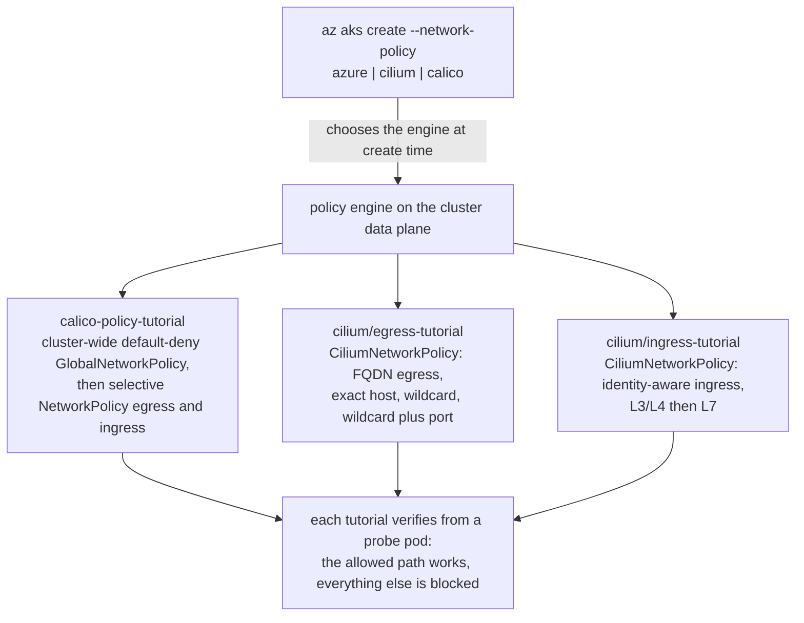

## Kubernetes Network Policy Tutorials

[Kubernetes network policies](https://kubernetes.io/docs/concepts/services-networking/network-policies/) control which pods may talk to each other and to the outside world. On AKS the rules are enforced by a policy engine tied to the cluster's data plane, so the engine is chosen when the cluster is created: [scripts/01-user-assigned-managed-identity.sh](../../scripts/01-user-assigned-managed-identity.sh) offers Azure, Cilium, and Calico network policy in its menu ([AKS network policies](https://learn.microsoft.com/en-us/azure/aks/use-network-policies)).

These tutorials each build a policy scenario step by step and verify, from inside probe pods, that allowed traffic flows and everything else is blocked.

| Tutorial | Engine | Demonstrates |
| --- | --- | --- |
| [calico/calico-policy-tutorial](calico/calico-policy-tutorial) | Calico | A cluster-wide default-deny `GlobalNetworkPolicy`, then namespaced `NetworkPolicy` rules that selectively re-open egress and ingress (zero trust). |
| [cilium/egress-tutorial](cilium/egress-tutorial) | Cilium | DNS-aware (FQDN) egress control: an exact hostname, a wildcard pattern, and a pattern locked to a single port. |
| [cilium/ingress-tutorial](cilium/ingress-tutorial) | Cilium | Identity-aware ingress, first at L3/L4 (which workloads may connect) and then at L7 (which HTTP calls they may make). |

> **Running on LocalStack?** Install the [lstk CLI](https://docs.localstack.cloud/aws/developer-tools/running-localstack/lstk/) and run `lstk az start-interception` to route Azure CLI calls to the emulator. See [Run against LocalStack](../../README.md#run-against-localstack) for the full setup.

## Architecture

The engine is chosen when the cluster is created, and each tutorial then builds its policy on top of it and verifies the result from inside probe pods:

## Prerequisites

- An AKS cluster reachable through `kubectl`, created with the policy engine that matches the tutorial you want to run (Calico for the Calico tutorial, Cilium for the two Cilium tutorials).
- [kubectl](https://kubernetes.io/docs/tasks/tools/) configured for the cluster.
- The engine's CLI, installed by each tutorial's `00-*.sh` script (`calicoctl` for Calico; `cilium` and `hubble` for Cilium).

Follow the README in each tutorial folder for the full walkthrough.

## Resources

- [Network Policies (Kubernetes documentation)](https://kubernetes.io/docs/concepts/services-networking/network-policies/)
- [Secure traffic between pods using network policies in AKS](https://learn.microsoft.com/en-us/azure/aks/use-network-policies)
- [Project Calico documentation](https://docs.tigera.io/calico/latest/about/)
- [Cilium documentation](https://docs.cilium.io/)
