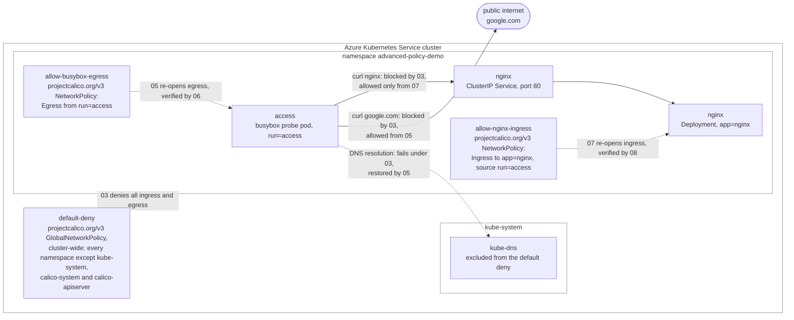

## Calico Network Policy Tutorial

This tutorial reproduces the [Calico policy tutorial](https://docs.tigera.io/calico/latest/network-policy/get-started/calico-policy/calico-policy-tutorial) on an AKS cluster (or the LocalStack for Azure emulator). It builds a zero-trust posture step by step: start with open connectivity, lock everything down with a cluster-wide default-deny, then selectively re-open egress and ingress until a single allowed path works while everything else stays blocked.

Calico policy is expressed with two [Project Calico](https://docs.tigera.io/calico/latest/reference/resources/globalnetworkpolicy) custom resources, applied with the `calicoctl` CLI rather than `kubectl`:

- A cluster-wide `GlobalNetworkPolicy` that denies all ingress and egress for every namespace except the system namespaces.
- Namespaced `NetworkPolicy` resources that allow specific egress and ingress on top of that baseline.

The demo runs in the `advanced-policy-demo` namespace with an `nginx` Deployment fronted by a ClusterIP Service and a busybox `access` pod used to probe connectivity.

> **Running on LocalStack?** Install the [lstk CLI](https://docs.localstack.cloud/aws/developer-tools/running-localstack/lstk/) and run `lstk az start-interception` to route Azure CLI calls to the emulator. See [Run against LocalStack](../../../../README.md#run-against-localstack) for the full setup.

## Architecture

The cluster-wide default-deny stays in force for the rest of the tutorial; the two namespaced policies then re-open exactly one path through it, one direction at a time:



## Prerequisites

- An AKS cluster reachable through `kubectl`, created with the **Calico** network-policy option of [scripts/01-user-assigned-managed-identity.sh](../../../../scripts/01-user-assigned-managed-identity.sh) (the script's menu offers Azure, Cilium, and Calico network policy; pick Calico).
- [kubectl](https://kubernetes.io/docs/tasks/tools/) configured for the cluster.
- `sudo` access on the host: `00-install-calicoctl.sh` installs the `calicoctl` binary to `/usr/local/bin`.

## How it works

Run the numbered scripts in order. Each verification step uses `kubectl exec` into the `access` pod and compares an allowed response (HTML) against a blocked one (`bad address` or a timeout).

| Script | What it does | Expected result |
| --- | --- | --- |
| `00-install-calicoctl.sh` | Installs the `calicoctl` CLI (required for the Calico CRDs). | CLI installed. |
| `01-deploy-demo.sh` | Deploys the `advanced-policy-demo` namespace, the `nginx` Deployment and Service, and the `access` pod. | Workloads become Ready. |
| `02-verify-access-allowed.sh` | Baseline connectivity from the `access` pod, before any policy. | `nginx` and `google.com` both reachable. |
| `03-create-default-deny-policy.sh` | Applies the cluster-wide default-deny `GlobalNetworkPolicy`. | Baseline lockdown in force. |
| `04-verify-access-denied.sh` | Re-tests connectivity under default-deny. | Both blocked; even DNS lookups fail. |
| `05-create-allow-busybox-egress-policy.sh` | Namespaced policy allowing all egress from the `access` pod. | Egress re-opened for `access`. |
| `06-verify-egress-allowed.sh` | Re-tests connectivity. | `google.com` reachable; `nginx` still blocked (no ingress rule yet). |
| `07-create-allow-nginx-ingress-policy.sh` | Namespaced policy allowing ingress to `nginx` from the `access` pod. | Ingress to `nginx` re-opened. |
| `08-verify-ingress-allowed.sh` | Re-tests connectivity. | `nginx` and `google.com` both reachable; everything else stays denied. |
| `09-get-policies.sh` | Lists and inspects the applied global and namespaced policies. | Policies shown. |
| `10-cleanup.sh` | Deletes the policies and the `advanced-policy-demo` namespace. | Demo removed. |

```bash
cd policies/calico/calico-policy-tutorial
./00-install-calicoctl.sh
./01-deploy-demo.sh
./02-verify-access-allowed.sh
# ... continue through 10-cleanup.sh in order
```

## Scripts

- `00-install-calicoctl.sh`: Downloads and installs the `calicoctl` CLI (required because Calico policies are `projectcalico.org/v3` custom resources, not stock Kubernetes objects).
- `01-deploy-demo.sh`: Applies `demo.yaml` and waits for the `nginx` Deployment and the `access` pod to become Ready.
- `02-verify-access-allowed.sh`: Confirms the baseline, where the `access` pod can reach both the in-cluster `nginx` Service and the public internet.
- `03-create-default-deny-policy.sh`: Applies `default-deny.yaml`, a cluster-wide `GlobalNetworkPolicy` denying all ingress and egress outside the system namespaces.
- `04-verify-access-denied.sh`: Confirms that under default-deny every connection from the `access` pod fails, including DNS resolution.
- `05-create-allow-busybox-egress-policy.sh`: Applies `allow-busybox-egress.yaml`, a namespaced `NetworkPolicy` allowing all egress from the `access` pod.
- `06-verify-egress-allowed.sh`: Confirms egress now works while ingress to `nginx` remains blocked.
- `07-create-allow-nginx-ingress-policy.sh`: Applies `allow-nginx-ingress.yaml`, a namespaced `NetworkPolicy` allowing ingress to `nginx` from the `access` pod.
- `08-verify-ingress-allowed.sh`: Confirms the full allowed path works while all other traffic stays denied.
- `09-get-policies.sh`: Lists the `GlobalNetworkPolicy` and namespaced `NetworkPolicy` resources and dumps the default-deny policy.
- `10-cleanup.sh`: Deletes the namespaced policies, the global default-deny policy, and the `advanced-policy-demo` namespace.

The Kubernetes and Calico manifests applied by the scripts are `demo.yaml`, `default-deny.yaml`, `allow-busybox-egress.yaml`, and `allow-nginx-ingress.yaml`.

## Resources

- [Calico policy tutorial](https://docs.tigera.io/calico/latest/network-policy/get-started/calico-policy/calico-policy-tutorial)
- [Kubernetes policy, advanced tutorial](https://docs.tigera.io/calico/latest/network-policy/get-started/kubernetes-policy/kubernetes-policy-advanced)
- [Install calicoctl](https://docs.tigera.io/calico/latest/operations/calicoctl/install)
- [Calico GlobalNetworkPolicy reference](https://docs.tigera.io/calico/latest/reference/resources/globalnetworkpolicy)
- [Calico NetworkPolicy reference](https://docs.tigera.io/calico/latest/reference/resources/networkpolicy)
- [Adopt a zero trust network model for security](https://docs.tigera.io/calico/latest/network-policy/adopt-zero-trust)
