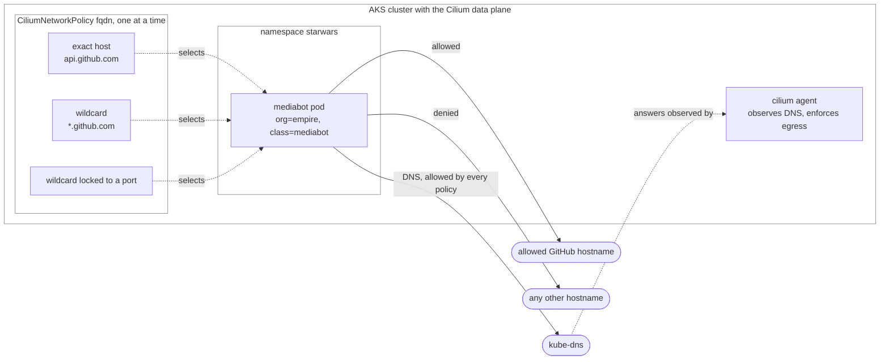

## Cilium DNS-Aware Egress Policy Tutorial

This tutorial demonstrates DNS-aware (FQDN) egress control with Cilium on an AKS cluster (or the LocalStack for Azure emulator). A `CiliumNetworkPolicy` restricts which external hostnames a pod may reach, and progressively tightens from an exact hostname, to a wildcard pattern, to a pattern locked to a single port.

It uses the Cilium [Star Wars demo](https://cilium.io/blog/2017/5/4/demo-may-the-force-be-with-you/): a `mediabot` pod (labels `org: empire`, `class: mediabot`) in the `starwars` namespace, which issues outbound `curl` calls to GitHub hostnames. Because Cilium enforces FQDN rules by observing DNS, each policy also allows DNS to kube-dns so the pod can still resolve names. The three policies are all named `fqdn`, so each `kubectl apply` overwrites the previous one.

> **Running on LocalStack?** Install the [lstk CLI](https://docs.localstack.cloud/aws/developer-tools/running-localstack/lstk/) and run `lstk az start-interception` to route Azure CLI calls to the emulator. See [Run against LocalStack](../../../../README.md#run-against-localstack) for the full setup.

## Architecture

Cilium enforces FQDN egress by watching the pod's DNS answers, so every policy also has to allow DNS itself:



## Prerequisites

- An AKS cluster reachable through `kubectl`, created with the **Cilium** network-policy option of [scripts/01-user-assigned-managed-identity.sh](../../../../scripts/01-user-assigned-managed-identity.sh) (the script's menu offers Azure, Cilium, and Calico network policy; pick Cilium).
- [kubectl](https://kubernetes.io/docs/tasks/tools/) configured for the cluster.
- The `cilium` and `hubble` CLIs, installed by `00-install-cilium-hubble-cli.sh` (needs `sudo`). `10-cilium-endpoint-list.sh` execs into the `cilium-agent` pod (`k8s-app=cilium` in `kube-system`).

## How it works

Run the numbered scripts in order. Each `*-call-services.sh` step execs into `mediabot` and `curl`s a set of hostnames, printing the expected allowed/blocked outcome per target.

| Script | What it does | Expected result |
| --- | --- | --- |
| `00-install-cilium-hubble-cli.sh` | Installs the `cilium` and `hubble` CLIs. | CLIs installed. |
| `01-deploy-demo.sh` | Deploys the `starwars` namespace and the `mediabot` pod. | `mediabot` becomes Ready. |
| `02-call-services.sh` | Baseline egress, before any policy. | All GitHub hostnames reachable. |
| `03-create-dns-matchname-policy.sh` | Applies `dns-matchname.yaml`, allowing egress only to the exact FQDN `api.github.com`. | Allow-list in force. |
| `04-call-services.sh` | Re-tests. | `api.github.com` reachable; `status.github.com` and the apex `github.com` blocked. |
| `05-create-dns-pattern-policy.sh` | Applies `dns-pattern.yaml`, allowing the wildcard pattern `*.github.com`. | Pattern in force. |
| `06-call-services.sh` | Re-tests. | `api.github.com` and `status.github.com` reachable; the apex `github.com` blocked (the pattern requires a subdomain label). |
| `07-create-dns-port-policy.sh` | Applies `dns-port.yaml`, restricting `*.github.com` to port `443/TCP`. | Port restriction in force. |
| `08-call-services.sh` | Re-tests. | HTTPS to `*.github.com` reachable; HTTP (port 80) blocked; the apex `github.com` blocked. |
| `09-get-policy.sh` | Dumps the `fqdn` `CiliumNetworkPolicy`. | Policy shown. |
| `10-cilium-endpoint-list.sh` | Lists the Cilium endpoints on the node running `mediabot`. | Endpoint state shown. |
| `11-cleanup.sh` | Deletes the `starwars` namespace. | Demo removed. |

```bash
cd policies/cilium/egress-tutorial
./00-install-cilium-hubble-cli.sh
./01-deploy-demo.sh
./02-call-services.sh
# ... continue through 11-cleanup.sh in order
```

## Scripts

- `00-install-cilium-hubble-cli.sh`: Downloads and installs the `cilium` and `hubble` CLIs.
- `01-deploy-demo.sh`: Applies `dns-sw-app.yaml` (the `mediabot` pod) and waits for it to become Ready.
- `02-call-services.sh`: Baseline egress, where `mediabot` can reach every GitHub hostname over HTTP and HTTPS.
- `03-create-dns-matchname-policy.sh`: Applies `dns-matchname.yaml`, a `CiliumNetworkPolicy` allowing egress only to the exact FQDN `api.github.com` (plus DNS to kube-dns).
- `04-call-services.sh`: Confirms that only `api.github.com` is reachable and other hostnames are blocked.
- `05-create-dns-pattern-policy.sh`: Applies `dns-pattern.yaml`, widening the allow-list to the pattern `*.github.com`.
- `06-call-services.sh`: Confirms that subdomains of `github.com` are reachable while the apex domain is not.
- `07-create-dns-port-policy.sh`: Applies `dns-port.yaml`, restricting `*.github.com` egress to port `443/TCP`.
- `08-call-services.sh`: Confirms that only HTTPS to `*.github.com` succeeds and HTTP is blocked.
- `09-get-policy.sh`: Dumps the current `fqdn` `CiliumNetworkPolicy` as YAML.
- `10-cilium-endpoint-list.sh`: Runs `cilium endpoint list` from the `cilium-agent` on the node hosting `mediabot`.
- `11-cleanup.sh`: Deletes the `starwars` namespace.

The demo pod and the three policies are defined in `dns-sw-app.yaml`, `dns-matchname.yaml`, `dns-pattern.yaml`, and `dns-port.yaml`.

## Resources

- [Cilium security tutorials](https://docs.cilium.io/en/latest/security/tutorial-toc/)
- [Locking down external access with DNS-based policies](https://docs.cilium.io/en/latest/security/dns/)
- [Cilium network policy](https://docs.cilium.io/en/latest/security/policy/#id1)
- [Install the Cilium CLI](https://docs.cilium.io/en/latest/gettingstarted/k8s-install-default/#install-the-cilium-cli)
- [Star Wars demo: may the force be with you](https://cilium.io/blog/2017/5/4/demo-may-the-force-be-with-you/)
