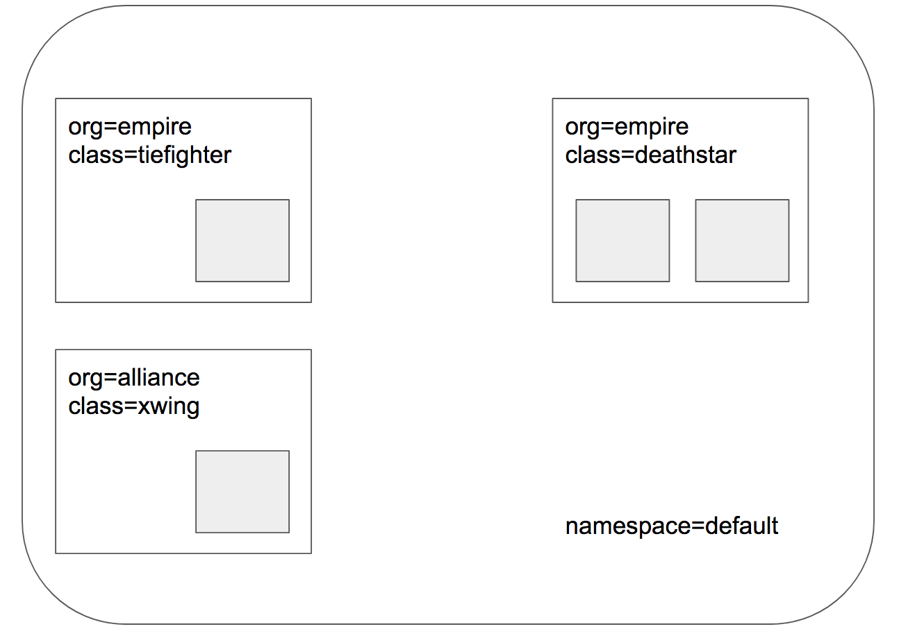
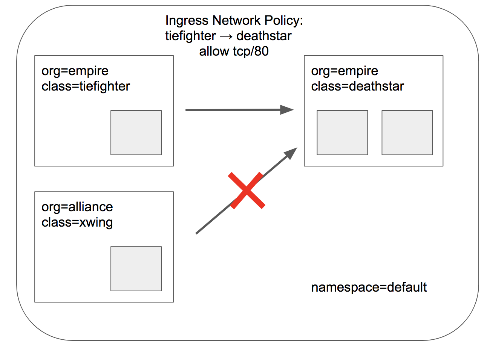
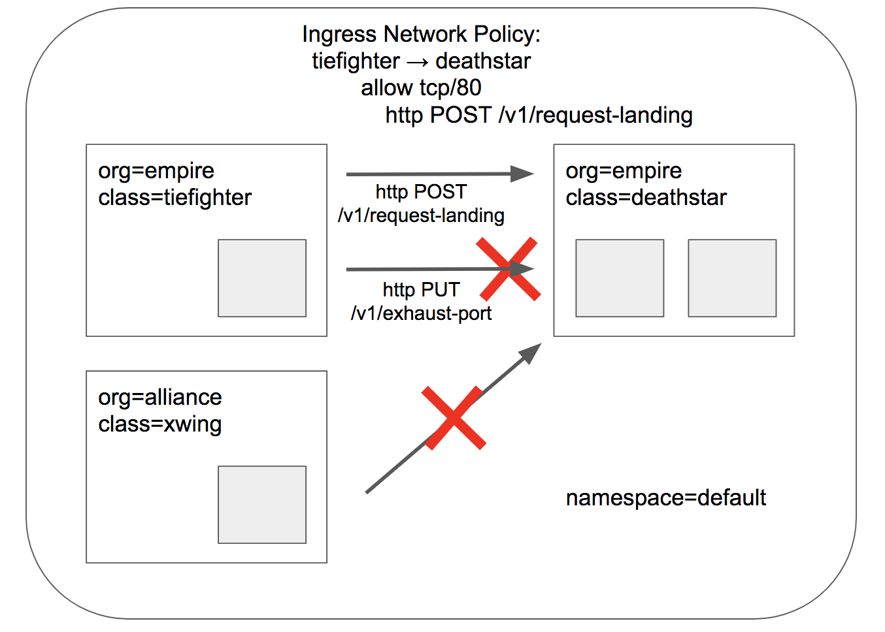
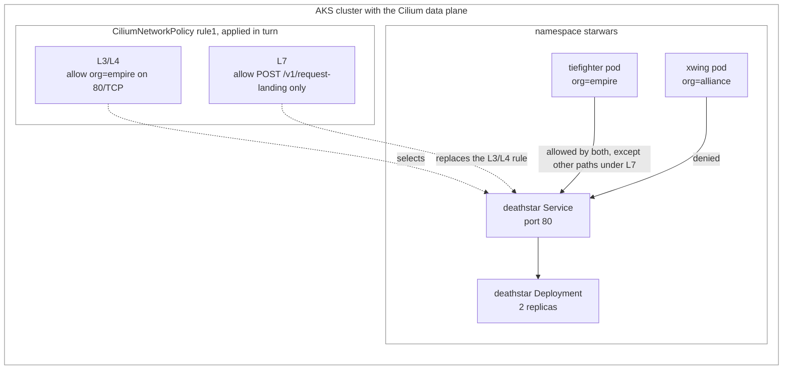

## Cilium L3/L4 and L7 Ingress Policy Tutorial

This tutorial demonstrates identity-aware ingress control with Cilium on an AKS cluster (or the LocalStack for Azure emulator), first at L3/L4 (which workloads may connect) and then at L7 (which HTTP calls they may make).

It uses the Cilium [Star Wars demo](https://cilium.io/blog/2017/5/4/demo-may-the-force-be-with-you/) in the `starwars` namespace: a `deathstar` Deployment (two replicas, labels `org: empire`, `class: deathstar`) fronted by a ClusterIP Service on port 80, plus two client pods, `tiefighter` (`org: empire`) and `xwing` (`org: alliance`). Both policies are named `rule1`, so applying the L7 policy overwrites the L3/L4 one.

Without any policy, every pod can reach the `deathstar` API:



An L3/L4 `CiliumNetworkPolicy` restricts the `deathstar` to empire ships on port 80/TCP, so the `xwing` is cut off entirely:



An L7 policy adds an HTTP filter so even empire ships may only call `POST /v1/request-landing`; the dangerous `PUT /v1/exhaust-port` is denied:



> **Running on LocalStack?** Install the [lstk CLI](https://docs.localstack.cloud/aws/developer-tools/running-localstack/lstk/) and run `lstk az start-interception` to route Azure CLI calls to the emulator. See [Run against LocalStack](../../../../README.md#run-against-localstack) for the full setup.

## Architecture

The same `deathstar` API, first restricted by workload identity at L3/L4, then by HTTP path at L7:



## Prerequisites

- An AKS cluster reachable through `kubectl`, created with the **Cilium** network-policy option of [scripts/01-user-assigned-managed-identity.sh](../../../../scripts/01-user-assigned-managed-identity.sh) (the script's menu offers Azure, Cilium, and Calico network policy; pick Cilium).
- [kubectl](https://kubernetes.io/docs/tasks/tools/) configured for the cluster.
- The `cilium` and `hubble` CLIs, installed by `00-install-cilium-hubble-cli.sh` (needs `sudo`). Several scripts exec into the `cilium-agent` pod (`k8s-app=cilium` in `kube-system`).

## How it works

Run the numbered scripts in order. The `*-call-*.sh` steps exec into the client pods and `curl` the `deathstar` Service, printing the expected allowed/blocked outcome.

| Script | What it does | Expected result |
| --- | --- | --- |
| `00-install-cilium-hubble-cli.sh` | Installs the `cilium` and `hubble` CLIs. | CLIs installed. |
| `01-deploy-demo.sh` | Deploys the `starwars` namespace, the `deathstar` Deployment and Service, and the `tiefighter` and `xwing` pods. | Workloads become Ready. |
| `02-cilium-endpoint-list.sh` | Lists the Cilium endpoints on the node running `deathstar`. | Endpoint state shown. |
| `03-cilium-policy-get.sh` | Dumps the policy currently loaded in a `cilium-agent`. | Loaded policy shown. |
| `04-cilium-monitor.sh` | Interactive: streams L7 events from a selected node's `cilium-agent` (optional observability). | Live L7 monitor. |
| `05-call-request-landing-web-method.sh` | Baseline: both ships `POST /v1/request-landing`. | Both succeed (no policy yet). |
| `06-call-other-web-method.sh` | Baseline: both ships `PUT /v1/exhaust-port`. | Both succeed (no policy yet). |
| `07-create-l3-l4-policy.sh` | Applies `sw-l3-l4-policy.yaml`: only `org=empire` may reach `deathstar` on 80/TCP. | L3/L4 policy in force. |
| `08-call-deathstar-methods.sh` | Re-tests both methods from both ships (L3/L4 only). | `tiefighter` (empire) succeeds on both methods; `xwing` (alliance) times out, blocked at L3. |
| `09-create-l3-l4-l7-policy.sh` | Applies `sw-l3-l4-l7-policy.yaml`: adds an HTTP filter allowing only `POST /v1/request-landing`. | L7 policy in force. |
| `10-call-deathstar-methods.sh` | Re-tests both methods from both ships. | `tiefighter` `POST /v1/request-landing` succeeds; its `PUT /v1/exhaust-port` is denied at L7; `xwing` still blocked at L3. |
| `11-get-policy.sh` | Dumps the `rule1` `CiliumNetworkPolicy`. | Policy shown. |
| `12-cleanup.sh` | Deletes the `starwars` namespace. | Demo removed. |

```bash
cd policies/cilium/ingress-tutorial
./00-install-cilium-hubble-cli.sh
./01-deploy-demo.sh
# ... continue through 12-cleanup.sh in order
```

## Scripts

- `00-install-cilium-hubble-cli.sh`: Downloads and installs the `cilium` and `hubble` CLIs.
- `01-deploy-demo.sh`: Applies `http-sw-app.yaml` and waits for the `deathstar` Deployment and the `tiefighter` and `xwing` pods to become Ready.
- `02-cilium-endpoint-list.sh`: Runs `cilium endpoint list` from the `cilium-agent` on the node hosting `deathstar`.
- `03-cilium-policy-get.sh`: Runs `cilium policy get` from a `cilium-agent` to show the loaded policy.
- `04-cilium-monitor.sh`: Interactively selects a node and streams L7 (`--type l7`) events with `cilium monitor`, so you can watch allowed and denied HTTP calls live.
- `05-call-request-landing-web-method.sh`: Baseline, where both `tiefighter` and `xwing` can `POST /v1/request-landing`.
- `06-call-other-web-method.sh`: Baseline, where both ships can `PUT /v1/exhaust-port`.
- `07-create-l3-l4-policy.sh`: Applies `sw-l3-l4-policy.yaml`, an L3/L4 `CiliumNetworkPolicy` restricting `deathstar` ingress to `org=empire` on port 80/TCP.
- `08-call-deathstar-methods.sh`: Confirms the L3/L4 result: `tiefighter` reaches both methods while `xwing` is blocked.
- `09-create-l3-l4-l7-policy.sh`: Applies `sw-l3-l4-l7-policy.yaml`, adding an L7 HTTP filter that allows only `POST /v1/request-landing`.
- `10-call-deathstar-methods.sh`: Confirms the L7 result: `tiefighter` may only call the allowed method, and `PUT /v1/exhaust-port` is denied.
- `11-get-policy.sh`: Dumps the current `rule1` `CiliumNetworkPolicy` as YAML.
- `12-cleanup.sh`: Deletes the `starwars` namespace.

The demo workloads and the two policies are defined in `http-sw-app.yaml`, `sw-l3-l4-policy.yaml`, and `sw-l3-l4-l7-policy.yaml`.

## Resources

- [Cilium security tutorials](https://docs.cilium.io/en/latest/security/tutorial-toc/)
- [Inspecting and enforcing HTTP with Cilium](https://docs.cilium.io/en/latest/security/http/#deploy-the-demo-application)
- [Cilium network policy](https://docs.cilium.io/en/latest/security/policy/#id1)
- [Install the Cilium CLI](https://docs.cilium.io/en/latest/gettingstarted/k8s-install-default/#install-the-cilium-cli)
- [Star Wars demo: may the force be with you](https://cilium.io/blog/2017/5/4/demo-may-the-force-be-with-you/)
