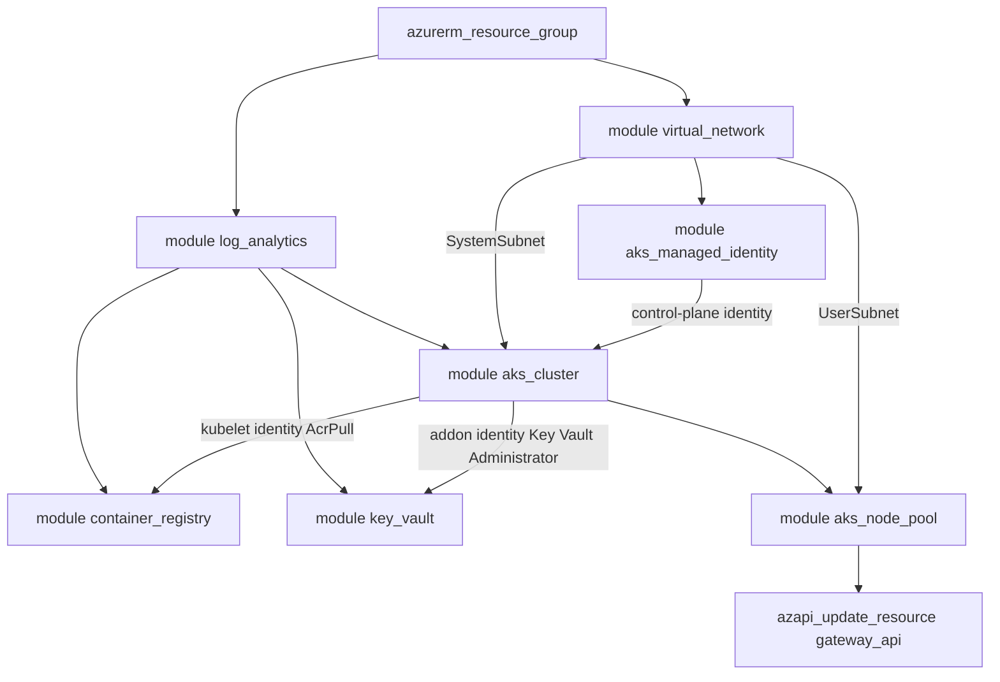

# Deploy an AKS cluster with agent-pool tags, node labels, and taints using Terraform

This sample deploys a modular [Azure Kubernetes Service (AKS)](https://learn.microsoft.com/en-us/azure/aks/what-is-aks) stack with [Terraform](https://developer.hashicorp.com/terraform) and focuses on the three properties you can use to classify and steer workloads across agent pools:

- [Azure resource tags](https://learn.microsoft.com/en-us/azure/azure-resource-manager/management/tag-resources) on the cluster, on every supporting resource, and on the agent-pool virtual machine scale sets.
- [Kubernetes node labels](https://learn.microsoft.com/en-us/azure/aks/use-labels) on the system and user agent pools.
- [Kubernetes node taints](https://learn.microsoft.com/en-us/azure/aks/use-node-taints) on the user agent pool.

The stack is a Terraform port of the Bicep version in `~/azure/aks/bicep/tags_labels_taints` and works against both real Azure and the [LocalStack for Azure](https://docs.localstack.cloud/azure/) emulator: [deploy.sh](deploy.sh) detects the target from the Azure CLI cloud configuration and adjusts the provider settings automatically.

By default the user agent pool carries the `workload=batch` node label, the `dedicated=batch:NoSchedule` node taint, and the `costcenter=1234` scale-set tags, while the system agent pool carries the `team=platform` node label — the values pinned in [terraform.tfvars](terraform.tfvars). The [deploy.sh](deploy.sh) validation battery then proves, both through the ARM API (`az aks nodepool show`) and through the Kubernetes API (`kubectl get nodes`), that the tags, labels, and taints actually landed on the pools and the nodes.

> **Running on LocalStack?** Install the [lstk CLI](https://docs.localstack.cloud/aws/developer-tools/running-localstack/lstk/) and run `lstk az start-interception` to route Azure CLI calls to the emulator. See [Run against LocalStack](../../../README.md#run-against-localstack) for the full setup.

## Prerequisites

- [Terraform](https://developer.hashicorp.com/terraform/install) `>= 1.9.0`. The providers are pinned in [providers.tf](providers.tf): [azurerm](https://registry.terraform.io/providers/hashicorp/azurerm/latest/docs) `4.81.0` and [azapi](https://registry.terraform.io/providers/Azure/azapi/latest/docs) `2.10.0`.
- [Azure CLI](https://learn.microsoft.com/en-us/cli/azure/install-azure-cli) (`az`), logged in to an Azure subscription — or pointed at the LocalStack Azure emulator.
- [kubectl](https://kubernetes.io/docs/tasks/tools/) and, on real Azure, [kubelogin](https://azure.github.io/kubelogin/) for the Microsoft Entra ID authentication used by the Kubernetes-side validation.
- [jq](https://jqlang.github.io/jq/) for parsing the Terraform outputs in `deploy.sh`.
- Optional: an SSH public key at `~/.ssh/id_rsa.pub`. On real Azure, `deploy.sh` reads it and passes it to the cluster's `linux_profile`; when it is absent — and always on the emulator, which ignores `linuxProfile` — the profile is omitted entirely.

## Architecture

The root [main.tf](main.tf) composes seven local Terraform modules around a single resource group, then adds the cross-module role assignments and the Managed Gateway API installation that no single module can own:



### Module composition

| Module | Resources | Purpose |
| --- | --- | --- |
| [`modules/log_analytics`](modules/log_analytics/main.tf) | [azurerm_log_analytics_workspace](https://registry.terraform.io/providers/hashicorp/azurerm/latest/docs/resources/log_analytics_workspace) | Workspace used by the cluster's `oms_agent` (Container Insights) and by every diagnostic setting in the stack. |
| [`modules/virtual_network`](modules/virtual_network/main.tf) | [azurerm_virtual_network](https://registry.terraform.io/providers/hashicorp/azurerm/latest/docs/resources/virtual_network), 2 × [azurerm_subnet](https://registry.terraform.io/providers/hashicorp/azurerm/latest/docs/resources/subnet) | Virtual network with a `SystemSubnet` for the system agent pool and a `UserSubnet` for the user agent pool. Subnet creation is serialized (`depends_on`) because parallel subnet writes on the same VNet fail with `AnotherOperationInProgress` on real Azure. |
| [`modules/aks_managed_identity`](modules/aks_managed_identity/main.tf) | [azurerm_user_assigned_identity](https://registry.terraform.io/providers/hashicorp/azurerm/latest/docs/resources/user_assigned_identity), [azurerm_role_assignment](https://registry.terraform.io/providers/hashicorp/azurerm/latest/docs/resources/role_assignment) | User-assigned managed identity used as the cluster control-plane identity, granted `Network Contributor` on the VNet so the cluster can manage the node subnets. |
| [`modules/container_registry`](modules/container_registry/main.tf) | [azurerm_container_registry](https://registry.terraform.io/providers/hashicorp/azurerm/latest/docs/resources/container_registry), [azurerm_monitor_diagnostic_setting](https://registry.terraform.io/providers/hashicorp/azurerm/latest/docs/resources/monitor_diagnostic_setting) | Azure Container Registry the kubelet identity pulls from (the `AcrPull` assignment lives in the root). Diagnostic settings ship the repository and login events plus all metrics to Log Analytics. |
| [`modules/key_vault`](modules/key_vault/main.tf) | [azurerm_key_vault](https://registry.terraform.io/providers/hashicorp/azurerm/latest/docs/resources/key_vault), [azurerm_role_assignment](https://registry.terraform.io/providers/hashicorp/azurerm/latest/docs/resources/role_assignment) (optional), [azurerm_monitor_diagnostic_setting](https://registry.terraform.io/providers/hashicorp/azurerm/latest/docs/resources/monitor_diagnostic_setting) | Key Vault with RBAC data-plane authorization, accessed by the Azure Key Vault Secrets Provider addon identity (role assigned in the root). Optionally grants the deploying user `Key Vault Administrator`. |
| [`modules/aks_cluster`](modules/aks_cluster/main.tf) | [azurerm_kubernetes_cluster](https://registry.terraform.io/providers/hashicorp/azurerm/latest/docs/resources/kubernetes_cluster), [azurerm_role_assignment](https://registry.terraform.io/providers/hashicorp/azurerm/latest/docs/resources/role_assignment) (optional), [azurerm_monitor_diagnostic_setting](https://registry.terraform.io/providers/hashicorp/azurerm/latest/docs/resources/monitor_diagnostic_setting) | The managed cluster with its system agent pool, network profile, addons, managed Microsoft Entra ID integration, auto-scaler profile, upgrade channels, Container Insights, and diagnostic settings (11 control-plane log categories plus all metrics). Optionally grants the deploying user `Azure Kubernetes Service RBAC Cluster Admin`. |
| [`modules/aks_node_pool`](modules/aks_node_pool/main.tf) | [azurerm_kubernetes_cluster_node_pool](https://registry.terraform.io/providers/hashicorp/azurerm/latest/docs/resources/kubernetes_cluster_node_pool) | The user agent pool on `UserSubnet`, carrying the sample's node labels, node taints, and scale-set tags. Deliberately has **no** `ignore_changes` on tags: tags, labels, and taints are the properties under test, so drift must surface in the plan. |

### Root-level resources

Alongside the modules, the root [main.tf](main.tf) declares:

- The [azurerm_resource_group](https://registry.terraform.io/providers/hashicorp/azurerm/latest/docs/resources/resource_group) hosting every resource.
- An [azapi_update_resource](https://registry.terraform.io/providers/Azure/azapi/latest/docs/resources/update_resource), created when `gateway_api_enabled` is true, that turns on the [Managed Gateway API](https://learn.microsoft.com/en-us/azure/aks/managed-gateway-api) (`ingressProfile.gatewayAPI.installation = "Standard"`). The azurerm provider does not expose this property yet ([hashicorp/terraform-provider-azurerm#31710](https://github.com/hashicorp/terraform-provider-azurerm/issues/31710)), and the patch is deliberately ordered after the user node pool because AKS serializes cluster operations and real Azure preempts concurrent updates with `AKSOperationPreempted`.
- An [azurerm_role_assignment](https://registry.terraform.io/providers/hashicorp/azurerm/latest/docs/resources/role_assignment) granting the AKS kubelet identity `AcrPull` on the container registry, so nodes pull images without credentials.
- An [azurerm_role_assignment](https://registry.terraform.io/providers/hashicorp/azurerm/latest/docs/resources/role_assignment), created when the Key Vault Secrets Provider addon is enabled, granting the addon identity `Key Vault Administrator` on the vault.

Every module except `aks_node_pool` applies the shared `tags` map (the user pool's scale-set tags come from `user_node_pool_tags` instead). The resource group and the Log Analytics, virtual network, managed identity, container registry, and Key Vault resources set `lifecycle { ignore_changes = [tags] }` so that tags added out-of-band (for example by Azure Policy) do not churn the plan; the cluster and the user node pool deliberately do not — tags are among the properties this sample tests, so their drift must surface.

## What is deployed by default

With the values currently in [variables.tf](variables.tf) and [terraform.tfvars](terraform.tfvars) (`prefix = "local"`, `suffix = "test"`), a plain `terraform apply` deploys:

| Resource | Default name | Default configuration |
| --- | --- | --- |
| Resource group | `local-rg` | `westeurope`, tagged `env=test`, `iac=terraform` (as is every resource below except the user agent pool, whose scale set carries only its own `costcenter=1234` tags). |
| Log Analytics workspace | `local-log-analytics-test` | `PerGB2018` sku, 60-day retention. |
| Virtual network | `local-vnet-test` | `10.0.0.0/8`, with `SystemSubnet` (`10.240.0.0/16`) and `UserSubnet` (`10.241.0.0/16`). |
| Managed identity | `local-aks-identity-test` | Cluster control-plane identity, `Network Contributor` on the VNet. |
| Container registry | `localacrtest` | `Basic` sku, admin user enabled, diagnostics to Log Analytics. |
| Key Vault | `local-kv-ciao-local` (pinned in tfvars; `deploy.sh` overrides it to `local-kv-test` on the emulator) | `standard` sku, RBAC authorization, 7-day soft delete, purge protection off, public network access with `Allow` ACLs — deliberate test-sample defaults. |
| AKS cluster | `local-aks-test` | `Free` tier, platform-default Kubernetes version (`deploy.sh` passes the latest non-preview version), user-assigned identity, `stable` automatic upgrade channel, `Unmanaged` node OS channel. |
| System agent pool | `system` | 1 × `Standard_DS2_v2`, `AzureLinux`, `Managed` OS disk, 100 max pods, autoscaling disabled (min 1 / max 3 when enabled), node label `team=platform`. |
| User agent pool | `upool1` | `User` mode, 1 × `Standard_DS2_v2`, `AzureLinux`, `Linux`, `Managed` OS disk, 100 max pods, autoscaling disabled (min 1 / max 3 when enabled), node label `workload=batch`, node taint `dedicated=batch:NoSchedule`, scale-set tags `costcenter=1234`. |

Default cluster configuration highlights:

- **Networking**: [Azure CNI Overlay](https://learn.microsoft.com/en-us/azure/aks/azure-cni-overlay) (`network_plugin = "azure"`, `network_plugin_mode = "overlay"`) with the `azure` network policy and data plane, pod CIDR `192.168.0.0/16`, service CIDR `172.16.0.0/16`, DNS service IP `172.16.0.10`, `loadBalancer` outbound type on a `standard` load balancer. `deploy.sh` offers a menu to switch the network policy to Calico, or to Cilium (which also switches the data plane to Cilium).
- **Identity and access**: [OIDC issuer](https://learn.microsoft.com/en-us/azure/aks/use-oidc-issuer) and [Microsoft Entra Workload ID](https://learn.microsoft.com/en-us/azure/aks/workload-identity-overview) enabled; managed Microsoft Entra ID integration with [Azure RBAC for Kubernetes authorization](https://learn.microsoft.com/en-us/azure/aks/manage-azure-rbac); Kubernetes RBAC enabled.
- **Addons and profiles**: [Azure Key Vault Secrets Provider](https://learn.microsoft.com/en-us/azure/aks/csi-secrets-store-driver) (secret rotation off), blob/disk/file CSI drivers and snapshot controller, [Vertical Pod Autoscaler](https://learn.microsoft.com/en-us/azure/aks/vertical-pod-autoscaler) (enabled in tfvars), KEDA off, cluster auto-scaler profile tuned with the sample defaults (`10s` scan interval, `random` expander, …).
- **Observability**: Container Insights (`oms_agent`) plus diagnostic settings on the cluster (11 log categories + `AllMetrics`), the registry, and the vault, all wired to the Log Analytics workspace.
- **Ingress**: the [Managed Gateway API](https://learn.microsoft.com/en-us/azure/aks/managed-gateway-api) standard-channel CRDs (`gateway_api_enabled = true`), installed via azapi on real Azure and via `az aks update --enable-gateway-api` on the emulator.

The full [terraform.tfvars](terraform.tfvars) also pins the feature toggles (`gateway_api_enabled`, `oidc_issuer_enabled`, `workload_identity_enabled`, `azure_keyvault_secrets_provider_enabled`, `vertical_pod_autoscaler_enabled`, the CSI drivers, `rbac_enabled`, `aad_enabled`, `aad_azure_rbac_enabled`) to `true` and sets the node counts of both pools (`node_count = 1`, `min_count = 1`, `max_count = 3`).

## Variables

Every module input is surfaced as a root variable in [variables.tf](variables.tf), grouped by concern, with the same default as the module so that overriding is always opt-in (the one exception is `tags`, which defaults to the sample's `env`/`iac` map at the root and to `{}` in the modules):

- **Provider / target selection** — `metadata_host`, `resource_manager_endpoint`, `subscription_id`, `tenant_id`, `client_id`, `client_secret`: the dual-target knobs. All identity fields default to `null` (Azure CLI authentication against real Azure); `deploy.sh` passes the LocalStack endpoints and all-zero GUIDs when it detects the emulator.
- **Naming** — `prefix`, `suffix`, and the per-resource `*_name` overrides. Empty names are derived from the prefix and suffix (for example `local-aks-test`, or `localacrtest` for the registry, whose name must be alphanumeric).
- **Cluster and agent pools** — `kubernetes_version`, `dns_prefix`, `sku_tier`, `vm_size`, the `system_node_pool_*` knobs (count, autoscaling, min/max, max pods, OS disk/sku, zones, labels), and the matching `user_node_pool_*` knobs (plus `mode`, `os_type`, taints, and tags).
- **Networking** — `virtual_network_address_space`, the subnet names and prefixes, `network_plugin`, `network_plugin_mode`, `network_policy`, `network_data_plane`, `pod_cidr`, `service_cidr`, `dns_service_ip`, `outbound_type`, `load_balancer_sku`.
- **Cluster features** — `gateway_api_enabled`, the OIDC/workload-identity/addon/CSI toggles, and the `rbac_*`/`aad_*` settings.
- **Upgrade and auto-scaler profile** — `automatic_upgrade_channel`, `node_os_upgrade_channel`, and the `auto_scaler_profile_*` tuning knobs.
- **Log Analytics, Container registry, Key Vault** — the sku/retention/access settings of the supporting resources.

See [variables.tf](variables.tf) for the complete list with descriptions and validation rules.

## Deployment

Run the deployment script from this directory:

```bash
./deploy.sh
```

The script drives the whole flow and validates the result end-to-end:

| Phase | What it does |
| --- | --- |
| Environment detection | Reads the Azure CLI resource-manager endpoint; a `localhost`/`localstack` endpoint switches every subsequent step to emulator mode. |
| CNI menu | Interactive choice among Azure CNI + Azure policy (default), Azure CNI + Cilium, Azure CNI + Calico. |
| Real-Azure preflight | Installs the `aks-preview` extension, registers the `ManagedGatewayAPIPreview` feature, resolves the signed-in user for the RBAC role assignments, reads the SSH public key, and purges/validates the globally-unique Key Vault name. Skipped on the emulator. |
| Kubernetes version | Looks up the latest non-preview Kubernetes version in the location (`az aks get-versions`, both targets) and passes it to Terraform. |
| Terraform | `init -upgrade` → `validate` → `plan -out=tfplan` → `apply`, passing the CNI selection and, on the emulator, the provider overrides (`metadata_host`, `resource_manager_endpoint`, all-zero GUIDs for subscription/tenant/client, a placeholder client secret, `key_vault_name=local-kv-test`, `gateway_api_enabled=false`). On real Azure it first adopts any Azure-Policy-created `diagnosticSettings` into the state, because Terraform refuses to overwrite unmanaged resources. |
| Gateway API (emulator) | Enables the Managed Gateway API through `az aks update --enable-gateway-api` — the azapi full-resource PUT is not persisted by the emulator (parity gap), so the CLI path replaces the azapi resource there. |
| ARM-side validation | Waits for `powerState Running`, then asserts through `az aks` / `az aks nodepool` that the cluster carries the `env=test` tag and the user pool its `costcenter=1234` tags, `workload=batch` label, and `dedicated=batch:NoSchedule` taint, that the gateway API, workload identity, secrets-provider addon, and VPA are configured, and that the `AcrPull` / `Key Vault Administrator` role assignments exist on the registry and vault. |
| Kubernetes-side validation | Merges credentials (`kubelogin` on real Azure), then asserts with `kubectl` that the nodes of the user pool carry the `workload=batch` label and a `dedicated` taint with the `NoSchedule` effect (the full taint string is asserted ARM-side), and that the addon daemonsets and Gateway API CRDs are present. |
| Summary | Prints the PASS/FAIL tally and exits non-zero when any check failed. |

To deploy without the script, pass at least the subscription (real Azure):

```bash
terraform init
terraform apply -var "subscription_id=$(az account show --query id --output tsv)"
```

### Outputs

| Output | Description |
| --- | --- |
| `cluster_name` | Name of the AKS cluster. |
| `user_node_pool_name` | Name of the user agent pool. |
| `acr_name` | Name of the container registry. |
| `key_vault_name` | Name of the Key Vault. |
| `log_analytics_workspace_name` | Name of the Log Analytics workspace. |
| `managed_identity_name` | Name of the AKS user-assigned managed identity. |
| `node_resource_group` | Node resource group of the AKS cluster. |
| `oidc_issuer_url` | OIDC issuer URL of the AKS cluster. |
| `key_vault_secrets_provider_object_id` | Object id of the Azure Key Vault Secrets Provider addon identity. |

## LocalStack emulator notes

The stack deploys cleanly on the LocalStack Azure emulator, with a few known parity gaps that `deploy.sh` works around or that are expected:

- The Managed Gateway API is enabled via the az CLI after apply (`gateway_api_enabled=false` is passed to Terraform), because the emulator does not persist `ingressProfile.gatewayAPI` from azapi's full-resource PUT.
- The emulator's `GET` does not echo back every profile the cluster was created with (upgrade settings, auto-scaler profile, some diagnostic and subnet defaults), so a post-apply `terraform plan` is never fully empty there: the post-apply no-op check in `deploy.sh` records a FAIL on the emulator today and prints the drift inventory.
- The Vertical Pod Autoscaler check in the validation battery fails on the emulator by design: the emulator drops `workloadAutoScalerProfile`.
- Key Vault auto-purge on destroy is skipped on the emulator (`purge_soft_delete_on_destroy` is tied to `metadata_host` in [providers.tf](providers.tf)), which keeps no soft-deleted vaults.

## Clean up

Destroy the stack with the same variables used to apply it (or just re-use `deploy.sh`'s emulator overrides when targeting LocalStack):

```bash
terraform destroy -var "subscription_id=$(az account show --query id --output tsv)"
```

On real Azure the provider purges the soft-deleted Key Vault automatically on destroy, so the globally-unique vault name can be reused on the next run.

## Resources

- [Use labels in an Azure Kubernetes Service (AKS) cluster](https://learn.microsoft.com/en-us/azure/aks/use-labels)
- [Use node taints in an Azure Kubernetes Service (AKS) cluster](https://learn.microsoft.com/en-us/azure/aks/use-node-taints)
- [Use tags to organize your Azure resources](https://learn.microsoft.com/en-us/azure/azure-resource-manager/management/tag-resources)
- [Install Managed Gateway API CRDs on Azure Kubernetes Service (AKS)](https://learn.microsoft.com/en-us/azure/aks/managed-gateway-api)
- [Use Microsoft Entra Workload ID with Azure Kubernetes Service](https://learn.microsoft.com/en-us/azure/aks/workload-identity-overview)
- [Terraform azurerm provider](https://registry.terraform.io/providers/hashicorp/azurerm/latest/docs)
- [Terraform azapi provider](https://registry.terraform.io/providers/Azure/azapi/latest/docs)
- [LocalStack for Azure](https://docs.localstack.cloud/azure/)
